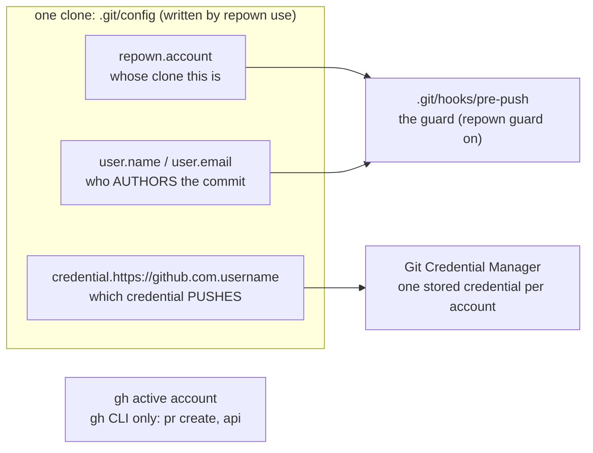
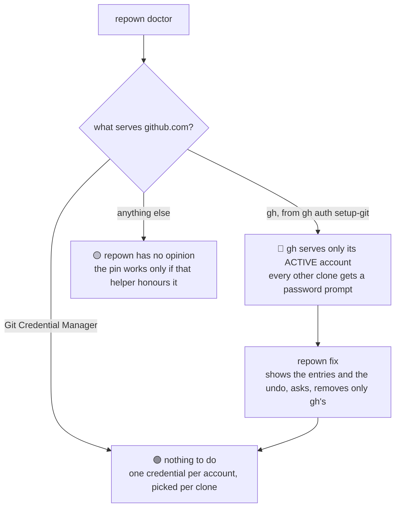
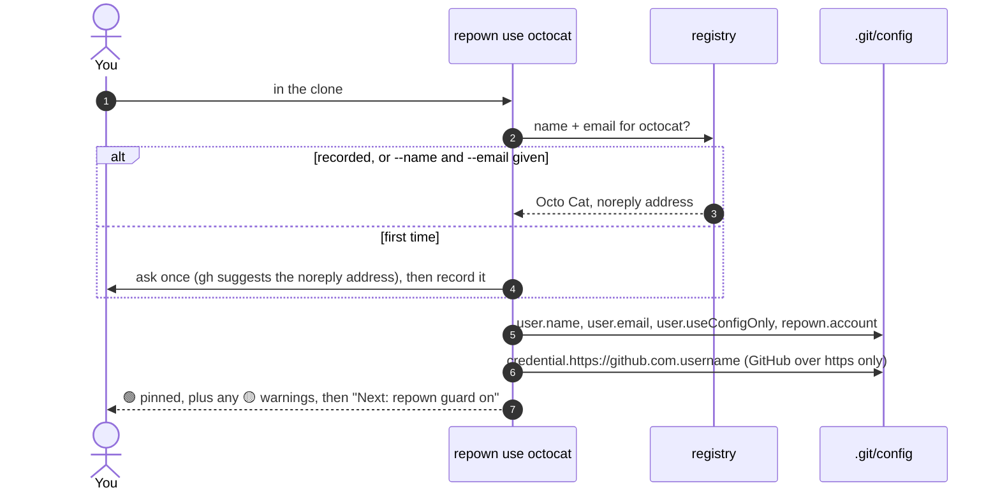
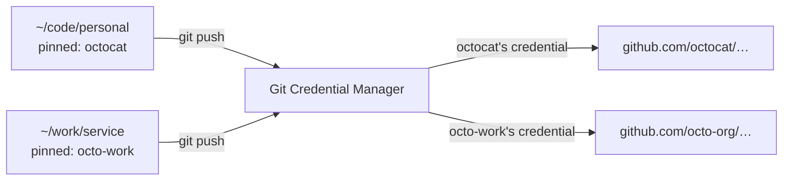
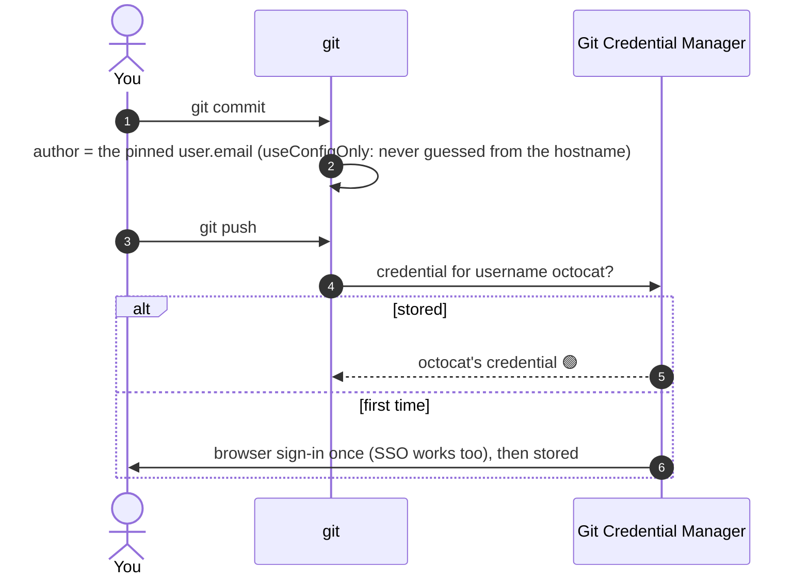
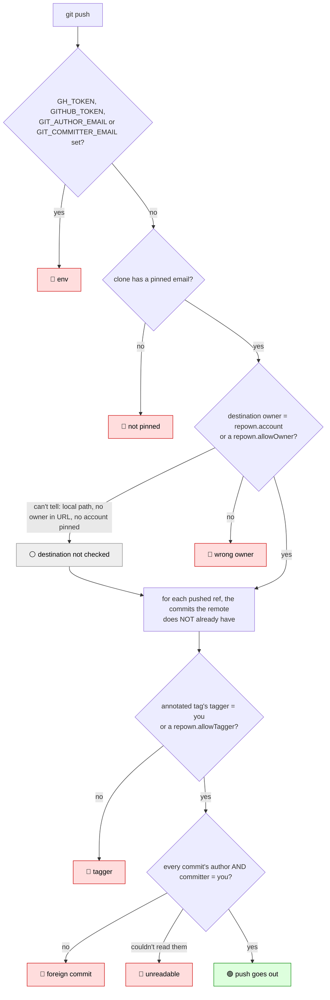
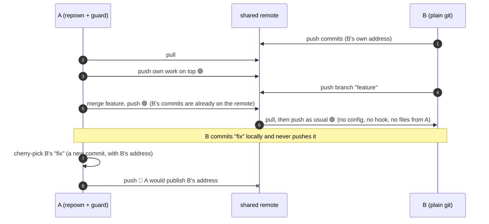
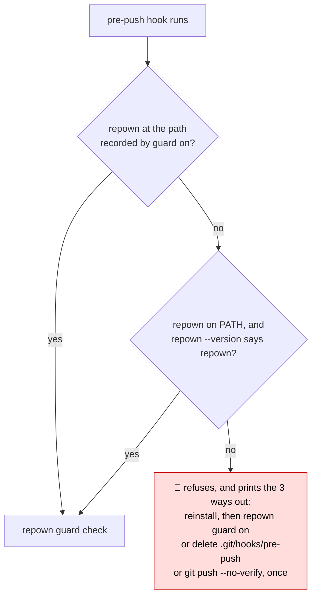

# How repown works

Every scenario, one card each. Read the headline, and click **Show how** when you want
the diagram and the detail. The reasons behind each rule are in
[DECISIONS.md](DECISIONS.md).

**In three lines:** each clone is pinned **once** to one account. Moving between
accounts is just `cd`. A `pre-push` guard checks every commit before it leaves.

🟢 passes · 🔴 refused · 🟡 warns · ⚪ not checked (always said out loud, never silent)

## The picture: three things decide who you are



repown writes only the clone's `.git/config` and `.git/hooks/pre-push`. Git never
pushes either, so nothing reaches the repository or your teammates. Global config is
changed only by `repown fix`, and only after it shows you what it removes.

## Find your case

| I want to… / What happened? | Card |
| --- | --- |
| Set up a new machine | [1](#1-set-up-the-machine) |
| Save an account once, use it everywhere | [2](#2-remember-an-account) |
| Make a clone belong to an account | [3](#3-pin-a-clone) |
| Work in account X, then Y, then Z | [4](#4-switch-accounts) |
| Check who I am in this clone | [5](#5-check-where-you-are) |
| Get asked for a password, or do my first push | [6](#6-commit-and-first-push) |
| Understand what the guard checks | [7](#7-push-what-the-guard-checks) |
| Fix a push the guard refused | [8](#8-push-refused-and-the-fix) |
| Work with a teammate who doesn't use repown | [9](#9-a-teammate-without-repown) |
| Use husky, or another pre-push hook | [10](#10-other-hook-tools) |
| Audit my clones, re-point one, or move to a new machine | [11](#11-audit-re-point-move-machines) |
| Uninstall repown, or fix "repown cannot be found" | [12](#12-uninstall-or-repown-missing) |

---

### 1. Set up the machine

**Once per machine.** `repown doctor` checks what serves git credentials. 🟢 Git
Credential Manager (GCM) needs nothing more. 🔴 If gh has become the helper, run `repown fix`.

<details><summary>Show how</summary>



| Variant | Command |
| --- | --- |
| See what `fix` would remove | `repown fix --dry-run` |
| No terminal, or a script | `repown fix --yes` |
| Undo `fix` | `gh auth setup-git` |
| Setting in the system scope | re-run `repown fix` in an elevated shell |

**Why:** switching gh's account moves the password prompt to your other account's
clones rather than fixing it ([§1](DECISIONS.md#1-git-credentials-come-from-the-credential-manager-gh-is-for-the-cli)).
</details>

### 2. Remember an account

**Once per account.** Record its commit name and email once, and every `repown use`
after that is one word.

<details><summary>Show how</summary>

```
repown accounts add octocat              # asks, suggesting gh's name and noreply address
repown accounts add octocat --name "Octo Cat" --email octocat@users.noreply.github.com
repown accounts add octo-work --host azdo
repown accounts list
repown accounts rm octocat               # clones already pinned keep their identity
```

The registry is `%APPDATA%\repown\accounts.json` on Windows and `~/.config/repown` on
Linux and macOS. `REPOWN_CONFIG_DIR` overrides both. It stores only a name and an
email, never a secret.
</details>

### 3. Pin a clone

**Once per clone.** `repown use <account>` writes the identity into `.git/config`. 🟢

<details><summary>Show how</summary>



| Variant | What happens |
| --- | --- |
| `--gh` | also runs `gh auth switch`, so `gh pr create` acts as the same account |
| No terminal and no record | 🔴 stops and tells you to run `repown accounts add <account> …` |
| SSH remote | no credential key is written, because your SSH key decides |
| Azure DevOps or another host | identity and guard work; 🟡 credentials are not pinned ([§6](DECISIONS.md#6-hosts-are-a-strategy-and-only-claim-what-was-measured)) |
| Repo owned by an organisation | 🟡 prints `git config --local --add repown.allowOwner octo-org` |
| gh is still the credential helper | 🟡 `fix: repown fix` |
| No stored credential yet | the first push signs in once ([card 6](#6-commit-and-first-push)) |
| Clone has submodules | each submodule is its own clone: pin and guard each one |

</details>

### 4. Switch accounts

**No command. Just `cd`.** Each clone already knows its account, so X, Y and Z work
side by side.

<details><summary>Show how</summary>



Compare `gh auth switch`, which is **machine-wide**. While gh is git's credential
helper, switching to X breaks every Y clone. After [`repown fix`](#1-set-up-the-machine),
gh's active account affects only the gh CLI. To keep it in step with a clone, run
`repown use <account> --gh`.
</details>

### 5. Check where you are

**`repown`** (short for `repown status`) prints all three identities. It changes nothing.

<details><summary>Show how</summary>

```
$ repown

  commits as     Octo Cat <octocat@users.noreply.github.com>
  pushes as      octocat
  origin         octocat  (GitHub)
  helper         manager
  gh active      octo-work
  push guard     on

WARN  gh         active as "octo-work", so `gh pr create` here would act as that account.
       fix: gh auth switch -u octocat
OK    identity   this clone is pinned, and its credential mechanism honours it
```

| You see | Meaning | Fix |
| --- | --- | --- |
| 🔴 `commits as NOT SET LOCALLY` | the clone inherits the machine default | `repown use <account>` |
| 🔴 `gh is the git credential helper` | only gh's active account can push | `repown fix` |
| 🟡 `no credential helper is set` / `cannot tell whether it honours` | the push account is pinned, but nothing that reads the pin serves credentials | `repown doctor` ([card 1](#1-set-up-the-machine)) |
| 🟡 `gh active as "…"` | the gh CLI would act as another account | `gh auth switch -u <account>` |
| 🟡 `origin belongs to "octo-org"` | an organisation repository | `git config --local --add repown.allowOwner octo-org` |
| 🟡 `guard off` | pushes are not checked | `repown guard on` |
| `pushes as not pinned by repown on …` | a host where credentials aren't pinned | nothing: expected |
| `origin no remote` | nothing to push to yet | nothing |

</details>

### 6. Commit and first push

**Commits use the pinned identity. The first push signs in once per account, and never
again.** 🟢

<details><summary>Show how</summary>



If a push fails right after signing in, the credential may be valid but not yet
**SSO-authorized** for that organisation. `repown doctor` says so; re-authorize with
`gh auth refresh -h github.com` or in the organisation's SSO settings.
</details>

### 7. Push: what the guard checks

**`repown guard on`** installs the hook. Every push runs these checks in this order.
It checks the **commits**, not today's config.

<details open><summary>Show how</summary>



🟢 These always pass:
- your own commits;
- a new branch;
- deleting a branch, since it publishes nothing;
- re-pushing commits the remote already has, on any of its branches: pulled work, merged
  branches.

`env` and `not pinned` stop at once. Wrong owner, tagger and commit refusals are all
reported together, so one push shows everything to fix. Each 🔴 is explained in
[card 8](#8-push-refused-and-the-fix). Credential problems never
block a push, because a failed login publishes nothing; `repown` and `repown doctor`
report those instead ([§8](DECISIONS.md#8-what-refuses-and-what-only-warns)).
</details>

### 8. Push refused, and the fix

**Every refusal says what, which commit, and the fix.** Nothing is published until
you choose.

<details><summary>Show how</summary>

```
FAIL  guard      1 commit(s) bound for refs/heads/main were not authored as octocat@users.noreply.github.com, or were committed by someone else.
         2eccc0911  someone@example.invalid  someone else's commit

       These addresses become permanent once pushed.

Push stopped by the repown identity guard (above).
Override this one push with: git push --no-verify
```

| 🔴 Refusal | Typical cause | Fix |
| --- | --- | --- |
| **foreign commit**, yours | committed before pinning, under the machine default | `git commit --amend --reset-author` (older commits: `git rebase -i`, amending each), then push again |
| **foreign commit**, a teammate's | cherry-picked, rebased or fetched from their fork, and not on the remote yet | let them push it, then pull; don't re-author their work ([card 9](#9-a-teammate-without-repown)) |
| **wrong owner** `push goes to "…"` | an organisation repository, or the wrong remote | organisation: `git config --local --add repown.allowOwner octo-org` |
| **env** `GH_TOKEN is set` | a token or email variable overrides the identity | unset it, then push again |
| **not pinned** | the clone has no identity, e.g. after `repown off` | `repown use <account>`, or `repown guard off` |
| **tagger** | an annotated tag made under another address | re-tag; for a fork pushing upstream's tags: `git config --local --add repown.allowTagger <address>` |
| **unreadable** | a force-push over a tip you never fetched, or a missing object | `git fetch`, then push again |
| ⚪ `destination not checked` | a local path, or a host with no owner in its URL | nothing: a note, not a refusal |

**A fork's mirror branch** is a branch that only fast-forwards to upstream. Set
`git config --local repown.mirrorBranch master` and upstream's commits there stop
counting, while a commit made here is still refused.

**Skip the guard for one push:** `git push --no-verify`. Only do this when you mean to
publish those addresses.
</details>

### 9. A teammate without repown

**They need nothing, and they see nothing.** You can still pull, merge and push as
usual. 🟢

<details><summary>Show how</summary>



Git never pushes `.git/config` or `.git/hooks`, so B's clone is untouched. The one
refusal is deliberate: the remote has never seen that commit, so A pushing it would
publish B's address from A's machine. This happens with a cherry-pick, a rebase, or a
fetch from B's fork. **If applying other people's patches is your daily work, as for a
maintainer, leave the guard off in that clone.** `repown use` still pins you. For a
whole team, use a server-side rule on author addresses.
</details>

### 10. Other hook tools

**repown never overwrites or deletes a hook it didn't write.** 🟡

<details><summary>Show how</summary>

| Situation | What repown does |
| --- | --- |
| A `pre-push` hook repown didn't write already exists | `guard on` and `guard off` leave it alone and say so |
| `core.hooksPath` is set (husky, lefthook…) | never writes or deletes there; `repown` warns and prints the line below |

To guard such a clone, call repown from that tool's `pre-push` hook, passing stdin through:

```sh
repown guard check --remote="$1" --url="$2"
```

</details>

### 11. Audit, re-point, move machines

**Auditing never changes anything. Re-pointing takes two commands.**

<details><summary>Show how</summary>

```
repown scan ~/code ~/work      # every clone: owner, host, identity, guard, addresses in history
repown scan --emails           # show the exact addresses instead of domains and counts
repown off && repown use octo-work   # re-point this clone to another account
```

| Kept where | Survives a re-clone or a new machine? |
| --- | --- |
| `.git/config`: identity, `repown.*` keys | ❌ run `repown use` again |
| `.git/hooks/pre-push`: the guard | ❌ run `repown guard on` again |
| registry: name and email per account | ✅ on this machine (copy it to a new one) |
| OS credential store: one credential per account | ✅ on this machine |
| global `.gitconfig`: helper, default identity | ✅ untouched by repown, except `repown fix` |

`scan`'s identity column: `pinned` · `INHERITED` (not pinned) · `commits only`
(name and email, no account). The guard stops **new** wrong addresses; it can't
rewrite history.
</details>

### 12. Uninstall, or repown missing

**Turn the guard off before removing repown.** A guard that can't find repown refuses
rather than letting a push through unchecked.

<details><summary>Show how</summary>



To uninstall cleanly:

```
repown scan <dir>        # the "guard" column shows where it's on
repown guard off         # in each of those clones
repown off               # optional: also drop the pinned identity
npm uninstall -g repown  # or: npm unlink -g repown
```

</details>
