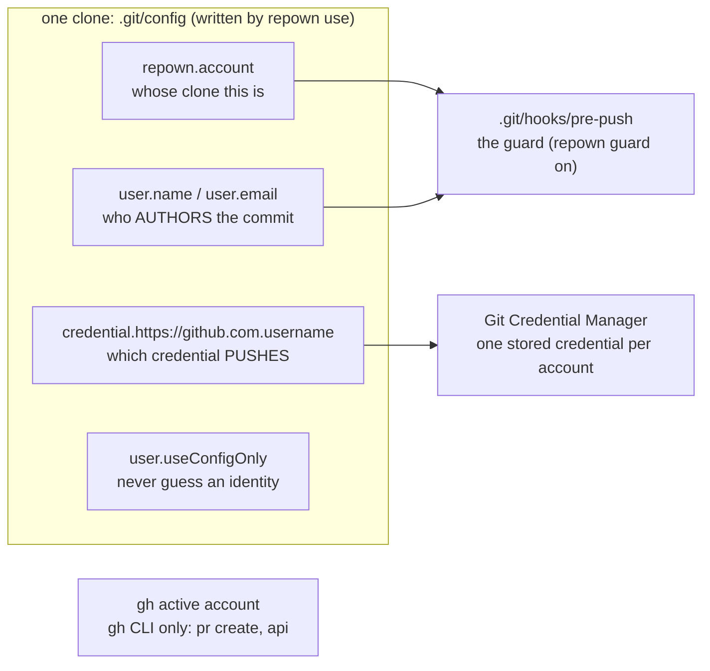
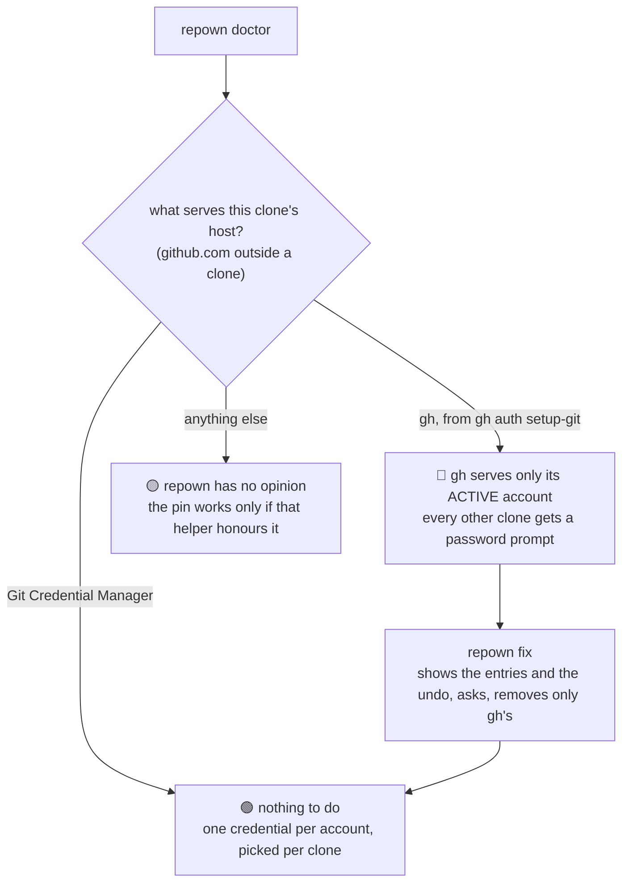
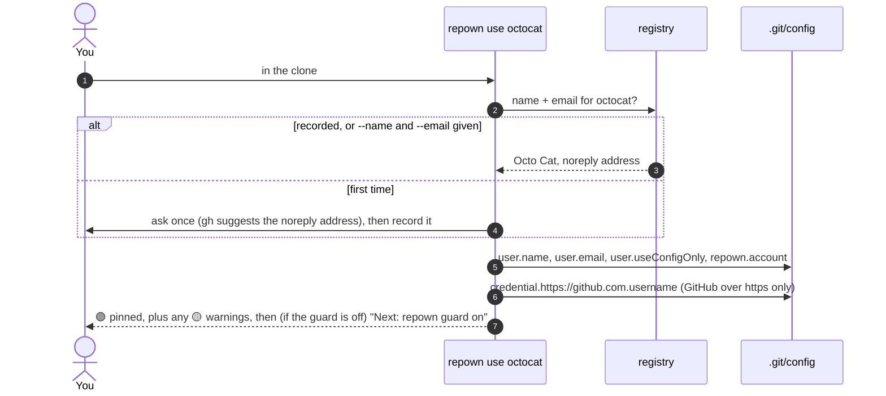
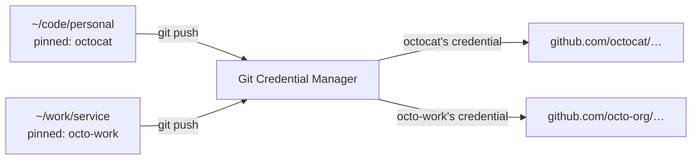
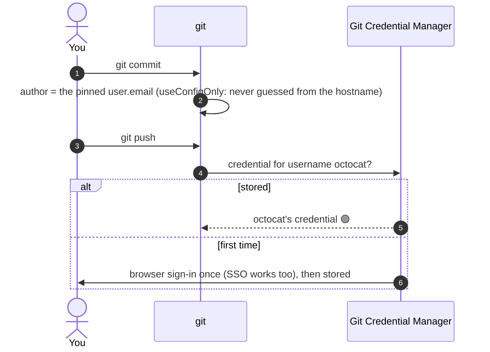
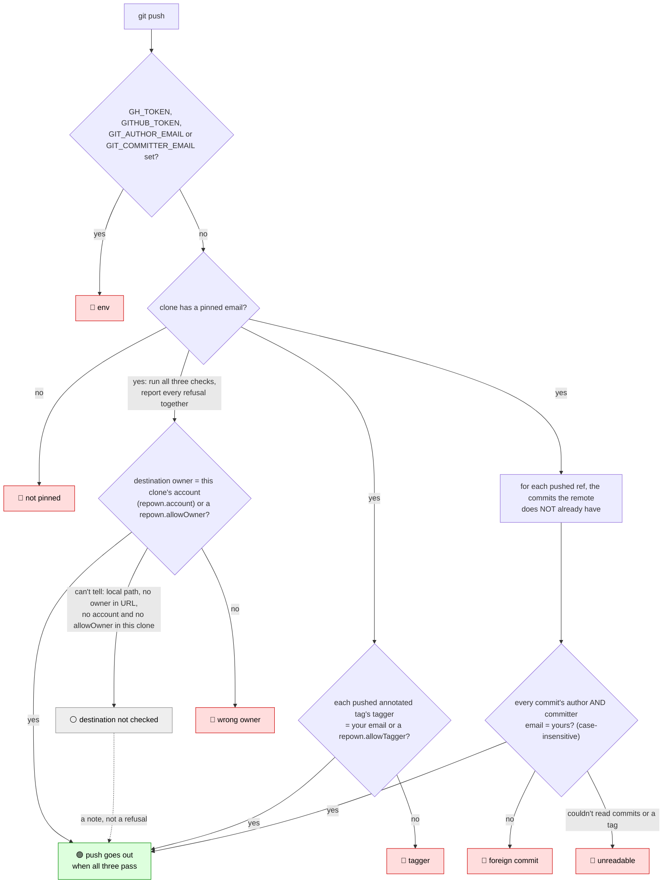
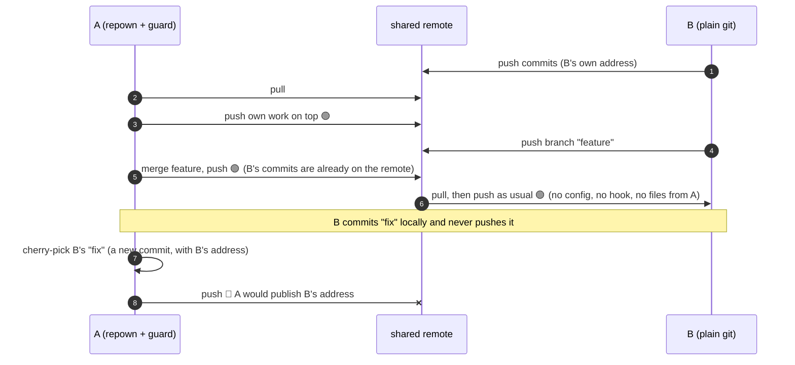
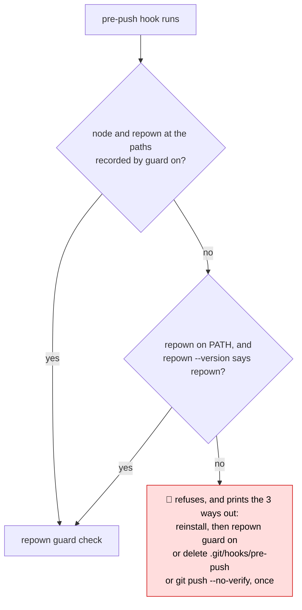
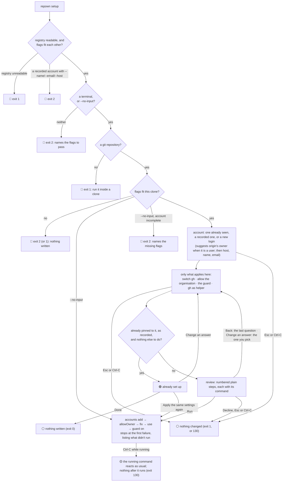

# How repown works

Every scenario, one card each. Read the headline, and click **Show how** when you want
the diagram and the detail. The reasons behind each rule are in
[decisions/](decisions/README.md), one ADR each.

**In three lines:** each clone is pinned **once** to one account. Moving between
accounts is just `cd`. A `pre-push` guard checks every commit before it leaves.

🟢 passes · 🔴 refused · 🟡 warns · ⚪ not checked (always said out loud, never silent)

## The picture: three things decide who you are


```mermaid
flowchart LR
  subgraph clone["one clone: .git/config (written by repown use)"]
    ID["user.name / user.email<br/>who AUTHORS the commit"]
    CRED["credential.https://github.com.username<br/>which credential PUSHES"]
    ACC["repown.account<br/>whose clone this is"]
    UCO["user.useConfigOnly<br/>never guess an identity"]
  end
  CRED --> GCM["Git Credential Manager<br/>one stored credential per account"]
  GH["gh active account<br/>gh CLI only: pr create, api"]
  HOOK[".git/hooks/pre-push<br/>the guard (repown guard on)"]
  ACC --> HOOK
  ID --> HOOK
```

Three things decide who you are: who authors commits (`user.name`/`user.email`), which
account pushes (the `credential…username` key), and who gh acts as. `repown.account`
records whose clone it is, for the guard.

Inside a clone, repown writes only `.git/config` and the pre-push hook, and git never
pushes either. Outside it, repown writes its account registry. Two commands go further,
only when you run them: `repown fix` removes gh's helper entries from your git config
(after showing them), and `repown use --gh` switches gh's active account. The full list:
[What repown writes](CONFIGURATION.md#what-repown-writes).

## Find your case

| I want to… / What happened? | Card |
| --- | --- |
| Be guided through it, one question at a time | [13](#13-guided-setup) |
| Set up a new machine | [1](#1-set-up-the-machine) |
| Save an account once, use it everywhere | [2](#2-remember-an-account) |
| Make a clone belong to an account | [3](#3-pin-a-clone) |
| Use Azure DevOps, SSH or another host | [3](#3-pin-a-clone) |
| Work in account X, then Y, then Z | [4](#4-switch-accounts) |
| Check who I am in this clone | [5](#5-check-where-you-are) |
| Get asked for a password on push | [1](#1-set-up-the-machine) (gh is the helper), [5](#5-check-where-you-are) (no helper) |
| Do my first push | [6](#6-commit-and-first-push) |
| Push failed right after signing in (SSO) | [6](#6-commit-and-first-push) |
| Understand what the guard checks | [7](#7-push-what-the-guard-checks) |
| Fix a push the guard refused | [8](#8-push-refused-and-the-fix) |
| Work with a teammate who doesn't use repown | [9](#9-a-teammate-without-repown) |
| Use husky, or another pre-push hook | [10](#10-other-hook-tools) |
| Audit my clones, re-point one, or move to a new machine | [11](#11-audit-re-point-move-machines) |
| Uninstall repown, or fix "repown cannot be found" | [12](#12-uninstall-or-repown-missing) |

---

### 1. Set up the machine

**Once per machine.** `repown doctor` checks which program hands git your sign-in (the
*credential helper*). 🟢 Git
Credential Manager (GCM) needs nothing more. 🔴 If gh has become the helper, run `repown fix`.

<details><summary>Show how</summary>


```mermaid
flowchart TD
  D[repown doctor] --> Q{"what serves this clone's host?<br/>(github.com outside a clone)"}
  Q -->|Git Credential Manager| OK["🟢 nothing to do<br/>one credential per account, picked per clone"]
  Q -->|gh, from gh auth setup-git| BAD["🔴 gh serves only its ACTIVE account<br/>every other clone gets a password prompt"]
  Q -->|anything else| W["🟡 repown has no opinion<br/>the pin works only if that helper honours it"]
  BAD --> F["repown fix<br/>shows the entries and the undo, asks, removes only gh's"]
  F --> OK
```

| Variant | Command |
| --- | --- |
| See what `fix` would remove | `repown fix --dry-run` |
| No terminal, or a script | `repown fix --yes` |
| Undo `fix` | `gh auth setup-git` |
| Setting in the system scope | re-run `repown fix` in an elevated shell |
| `GCM` shows `not found` | install [Git Credential Manager](https://github.com/git-ecosystem/git-credential-manager/blob/main/docs/install.md) (Git for Windows includes it), then run `repown doctor` again |
| `helper` shows `none configured` | `git credential-manager configure` makes GCM git's helper, then run `repown doctor` again |
| `store  no accounts stored yet` | nothing: expected before the first push |

`doctor` exits 1 only when gh is the helper.

**Why:** switching gh's account moves the password prompt to your other account's
clones rather than fixing it ([ADR-001](decisions/ADR-001-credential-manager-not-gh.md)).
</details>

### 2. Remember an account

**Once per account.** Record its commit name and email once, and every `repown use`
after that is one word.

<details><summary>Show how</summary>

```
repown accounts add octocat              # asks; with gh signed in, suggests <id>+octocat@users.noreply.github.com
repown accounts add octocat --name "Octo Cat" --email octocat@users.noreply.github.com
repown accounts add octo-work --host azdo
repown accounts list
repown accounts remove octocat           # clones already pinned keep their identity
```

The registry stores a name, an email and a host per account, never a secret, outside
every repository ([where](CONFIGURATION.md#the-account-registry)). Run `add` again to
change an account; pinned clones keep the old values until you `repown use` it again.
Without a terminal, `add` can't ask: pass `--name` and `--email`.
</details>

### 3. Pin a clone

**Once per clone.** `repown use <account>` writes the identity into `.git/config`. 🟢

<details><summary>Show how</summary>


```mermaid
sequenceDiagram
  autonumber
  actor You
  participant R as repown use octocat
  participant Reg as registry
  participant G as .git/config
  You->>R: in the clone
  R->>Reg: name + email for octocat?
  alt recorded, or --name and --email given
    Reg-->>R: Octo Cat, noreply address
  else first time
    R->>You: ask once (gh suggests the noreply address), then record it
  end
  R->>G: user.name, user.email, user.useConfigOnly, repown.account
  R->>G: credential.https://github.com.username (GitHub over https only)
  R-->>You: 🟢 pinned, plus any 🟡 warnings, then (if the guard is off) "Next: repown guard on"
```

| Variant | What happens |
| --- | --- |
| `--gh`, already signed in | `gh auth switch`, so `gh pr create` acts as the same account |
| `--gh`, not signed in, in a terminal | `gh auth login` opens the browser; sign in there as this account (a private window helps). gh before 2.40.0 replaces an account, so repown refuses and tells you to upgrade |
| gh's question | "Authenticate Git with your GitHub credentials?": not asked when gh is already the helper. Another helper (Git Credential Manager, or whatever is configured): Yes also stores this sign-in there, so the first push won't ask again. No helper: answer No. Yes would make gh answer git's sign-in requests for every repository, and repown would then need `repown fix` |
| `--gh`, gh becomes the helper | 🟡 when gh was not the helper before the login and is afterwards: `fix: repown fix` |
| `--gh`, no terminal, not signed in | 🟡 `<account> isn't signed in to gh`. `fix: gh auth login, then repown use <account> --gh`. No login |
| No terminal and no record | 🔴 stops and tells you to run `repown accounts add <account> …` |
| SSH remote | no credential key is written, because your SSH key decides; 🟡 `use` says credentials are not pinned for this remote |
| Azure DevOps or another host | identity and guard work; 🟡 credentials are not pinned ([ADR-009](decisions/ADR-009-hosts-claim-only-measured.md)). On Azure DevOps the owner is the organisation, so allow it with `repown.allowOwner` |
| Repo owned by an organisation | 🟡 prints the line that allows it ([card 5](#5-check-where-you-are)) |
| gh is still the credential helper | 🟡 `fix: repown fix` |
| No stored credential yet | the first push signs in once ([card 6](#6-commit-and-first-push)) |

</details>

### 4. Switch accounts

**No command. Just `cd`.** Each clone already knows its account, so X, Y and Z work
side by side.

<details><summary>Show how</summary>


```mermaid
flowchart LR
  A["~/code/personal<br/>pinned: octocat"] -->|git push| GCM[Git Credential Manager]
  B["~/work/service<br/>pinned: octo-work"] -->|git push| GCM
  GCM -->|octocat's credential| H1[github.com/octocat/…]
  GCM -->|octo-work's credential| H2[github.com/octo-org/…]
```

Compare `gh auth switch`, which is **machine-wide** ([why that breaks clones](#1-set-up-the-machine)).
After `repown fix`, gh's active account affects only the gh CLI. To keep it in step with a clone, run
`repown use <account> --gh`.
</details>

### 5. Check where you are

In a terminal, bare **`repown`** starts `repown setup` in a clone that isn't set up, shows
status in one that is, and shows the help outside a clone (exit 0). Without a terminal, or
with its output redirected, it is always status (exit 1 outside a clone). **`repown status`**
prints all three identities and changes nothing.

<details><summary>Show how</summary>

```
$ repown

repown status · current settings of this clone
  ~/code/personal  (branch main)

This clone
  commits as     Octo Cat <octocat@users.noreply.github.com>
  pushes as      octocat
  account        octocat  (recorded)
  origin         octocat  (GitHub)
  push guard     on

This machine
  default        Octo Work <octo-work@example.invalid>
  helper         manager
  gh active      octo-work

WARN  gh         active as "octo-work", so `gh pr create` here would act as that account.
       fix: gh auth switch -u octocat
OK    identity   this clone is pinned, and its credential mechanism honours it

1 warning
```

| You see | Meaning | Fix |
| --- | --- | --- |
| 🔴 `This clone sets no identity of its own` (`commits as` shows `NOT SET LOCALLY` or a `?`) | the clone sets no name or email of its own | `repown setup` (or `repown use <account>`) |
| 🔴 `No account is pinned` | a GitHub https clone with no push account; pushes use the machine default | `repown setup` (or `repown use <account>`) |
| 🔴 `gh is the git credential helper` | only gh's active account can push | `repown fix` |
| 🟡 `no credential helper is set` / `cannot tell whether it honours` | a GitHub https clone, and the helper isn't Git Credential Manager | `repown doctor` ([card 1](#1-set-up-the-machine)) |
| 🟡 `gh active as "…"` | the gh CLI would act as another account | `gh auth switch -u <account>` when that account is signed in to gh; `repown use <account> --gh` when it is not |
| 🟡 `gh could not be queried` | who `gh pr create` acts as is unknown | `gh auth status` |
| 🟡 `origin belongs to "octo-org"` | an organisation repository | `git config --local --add repown.allowOwner octo-org` |
| 🟡 `guard off` | pushes are not checked | `repown guard on` |
| 🟡 a pre-push hook repown did not write, or `core.hooksPath` | another tool owns the hook | [card 10](#10-other-hook-tools) |
| 🟡 `this clone has submodules` | each submodule is a clone of its own | `git submodule foreach "repown use <account> && repown guard on"` |
| 🟡 `this clone commits as …, but <account> is recorded as …` | the clone's identity drifted from the record | `repown use <account>` |
| 🟡 `the account registry could not be read` | this clone's account was not compared with the registry | `repown accounts list` |
| 🟢 `commit identity is pinned; its credentials are left to …` | a host where repown doesn't pin credentials, or a helper other than Git Credential Manager (see the 🟡 helper row) | nothing on other hosts; on GitHub, `repown doctor` |
| `pushes as not pinned by repown on …` | a host where credentials aren't pinned | nothing: expected |
| `account … (not in this machine's registry)` | pinned by hand or on another machine | `repown accounts add <account> --name "..." --email "..."` |
| `origin no remote` | nothing to push to yet | nothing |

🔴 rows exit 1; 🟡 rows alone exit 0. Stderr then ends with a count (`1 problem, 2 warnings`),
adding `: run repown setup` when an identity problem is among them. Outside a clone,
`repown status` prints `Not a git repository` and exits 1. Bare `repown` does that only
without a terminal or with its output redirected; in a terminal it shows the help and
exits 0. A bare repository takes that same path.

</details>

### 6. Commit and first push

**Commits use the pinned identity. On GitHub over https, the first push signs in once per
account, and never again;** on SSH or other hosts, your usual sign-in applies. 🟢

<details><summary>Show how</summary>


```mermaid
sequenceDiagram
  autonumber
  actor You
  participant Git as git
  participant GCM as Git Credential Manager
  You->>Git: git commit
  Git->>Git: author = the pinned user.email (useConfigOnly: never guessed from the hostname)
  You->>Git: git push
  Git->>GCM: credential for username octocat?
  alt stored
    GCM-->>Git: octocat's credential 🟢
  else first time
    GCM->>You: browser sign-in once (SSO works too), then stored
  end
```

**Push failed just after signing in?** Your organisation may use SSO, and the new
credential isn't authorized for it yet. Authorize it in the organisation's SSO settings on
GitHub, then push again. repown can't detect this in advance; `repown doctor` prints a
reminder when Git Credential Manager is the helper.
</details>

### 7. Push: what the guard checks

**`repown guard on`** installs the hook. Every push runs these checks in this order.
It checks every commit being pushed, so a commit made before you pinned the clone is
still caught.

<details open><summary>Show how</summary>


```mermaid
flowchart TD
  P[git push] --> E{GH_TOKEN, GITHUB_TOKEN,<br/>GIT_AUTHOR_EMAIL or GIT_COMMITTER_EMAIL set?}
  E -->|yes| X1[🔴 env]
  E -->|no| I{clone has a pinned email?}
  I -->|no| X2[🔴 not pinned]
  I -->|"yes: run all three checks,<br/>report every refusal together"| O{"destination owner = this clone's account<br/>(repown.account) or a repown.allowOwner?"}
  I -->|yes| T{"each pushed annotated tag's tagger<br/>= your email or a repown.allowTagger?"}
  I -->|yes| C["for each pushed ref, the commits the remote<br/>does NOT already have"]
  O -->|"can't tell: local path, no owner in URL,<br/>no account and no allowOwner in this clone"| N[⚪ destination not checked]
  O -->|no| X3[🔴 wrong owner]
  T -->|no| X4[🔴 tagger]
  C --> A{"every commit's author AND committer<br/>email = yours? (case-insensitive)"}
  A -->|no| X5[🔴 foreign commit]
  A -->|"couldn't read commits or a tag"| X6[🔴 unreadable]
  O -->|yes| OK["🟢 push goes out<br/>when all three pass"]
  N -.->|a note, not a refusal| OK
  T -->|yes| OK
  A -->|yes| OK
  classDef bad fill:#fdd,stroke:#c00,color:#000
  classDef good fill:#dfd,stroke:#080,color:#000
  classDef na fill:#eee,stroke:#888,color:#000
  class X1,X2,X3,X4,X5,X6 bad
  class OK good
  class N na
```

🟢 These always pass:
- your own commits, on a new branch or an existing one;
- deleting a branch, since it publishes nothing;
- re-pushing commits already on one of that remote's branches, as of your last fetch:
  pulled work, merged branches.

- **Stop at once:** `env`, `not pinned`.
- **Reported together,** so one push shows everything to fix: wrong owner, tagger, foreign
  commits. Each 🔴 is explained in [card 8](#8-push-refused-and-the-fix).
- **Compared:** email addresses only, case-insensitive, never names. A variable set to an
  empty string counts as unset.
- **⚪ destination not checked** shows as a `WARN` line, and the push still goes out.
- **Never blocks:** credential problems, because a failed login publishes nothing;
  `repown` and `repown doctor` report those ([ADR-011](decisions/ADR-011-refuse-vs-warn.md)).
</details>

### 8. Push refused, and the fix

**Each refusal says what's wrong and how to fix it;** a commit refusal also lists the
commits. Nothing leaves until you fix it, or skip the check once.

<details><summary>Show how</summary>

```
FAIL  guard      1 commit(s) bound for refs/heads/main were not authored as octocat@users.noreply.github.com, or were committed by someone else.
         2eccc0911  someone@example.invalid  someone else's commit

       These addresses become permanent once pushed.


Push stopped by the repown identity guard (above).
Override this one push with: git push --no-verify
```

| 🔴 Refusal | Typical cause | Fix |
| --- | --- | --- |
| **foreign commit**, yours | committed before pinning, or by an IDE with its own identity | last commit: `git commit --amend --reset-author --no-edit`; older ones: `git rebase <last-good> --exec "git commit --amend --reset-author --no-edit"`; then push again |
| **foreign commit**, a teammate's | cherry-picked, rebased or fetched from their fork, and not on the remote yet | let them push it, then pull; don't re-author their work ([card 9](#9-a-teammate-without-repown)) |
| **wrong owner** `push goes to "…"` | an organisation repository, or the wrong remote | organisation: `git config --local --add repown.allowOwner octo-org` |
| **env** `GH_TOKEN is set` | a token or email variable overrides the identity | unset it, then push again |
| **not pinned** | the clone has no identity, e.g. after `repown off` | `repown use <account>`, or `repown guard off` |
| **tagger** | an annotated tag made under another address | re-tag; for a fork pushing upstream's tags: `git config --local --add repown.allowTagger <address>` |
| **unreadable** | a missing object, a tag it can't read, or history repown can't parse | `git fetch`, then push again; if it says it can't parse, inspect the commits yourself |
| ⚪ `destination not checked` | a local path, a URL with no owner, or no account or `repown.allowOwner` to compare | nothing: a note, not a refusal; `repown use` again pins the account |

**A fork's mirror branch** is a branch that only fast-forwards to upstream. Set
`git config --local repown.mirrorBranch master` and commits already on any remote stop
counting there, while a commit made here is still refused. Fetch upstream first, and
don't set it on a clone with a private remote.

`repown.allowOwner`, `repown.allowTagger` and `repown.mirrorBranch` count only in the
clone's own config, never global. A tag's tagger is checked even on a public commit,
because whether the tag itself is public can't be told offline.

**Skip the guard for one push:** `git push --no-verify`. Only do this when you mean to
publish those addresses.
</details>

### 9. A teammate without repown

**They need nothing, and they see nothing.** You can still pull, merge and push as
usual. 🟢

<details><summary>Show how</summary>


```mermaid
sequenceDiagram
  autonumber
  participant A as A (repown + guard)
  participant R as shared remote
  participant B as B (plain git)
  B->>R: push commits (B's own address)
  A->>R: pull
  A->>R: push own work on top 🟢
  B->>R: push branch "feature"
  A->>R: merge feature, push 🟢 (B's commits are already on the remote)
  R->>B: pull, then push as usual 🟢 (no config, no hook, no files from A)
  Note over A,B: B commits "fix" locally and never pushes it
  A->>A: cherry-pick B's "fix" (a new commit, with B's address)
  A-xR: push 🔴 A would publish B's address
```

Git never pushes `.git/config` or `.git/hooks`, so B's clone is untouched. The one
refusal is deliberate: the remote has never seen that commit, so A pushing it would
publish B's address from A's machine. This happens with a cherry-pick, a rebase, or a
fetch from B's fork. **If applying other people's patches is your daily work, as for a
maintainer, leave the guard off in that clone.** `repown use` still pins you. For a
whole team, use a server-side rule on author addresses.
</details>

### 10. Other hook tools

**repown never overwrites or deletes a hook it didn't write.** 🟡

<details><summary>Show how</summary>

| Situation | What repown does |
| --- | --- |
| A `pre-push` hook repown didn't write already exists | `guard on` and `guard off` leave it alone, say so, and exit 1 |
| `core.hooksPath` is set (husky, lefthook…) | never writes or deletes there; `guard on` refuses and `repown` warns, and both print the line below |
| A repown hook left in `.git/hooks` while `core.hooksPath` is set | `guard off` still removes it, so it can't come back when `core.hooksPath` is unset; if a repown hook is in that directory too, it says so instead of `off` |

To guard such a clone, call repown from that tool's `pre-push` hook, passing stdin through:

```sh
repown guard check --remote="$1" --url="$2"
```

If that hook is committed (husky's usually is), teammates without repown would get
"command not found" on every push. Skip it for them:

```sh
if command -v repown >/dev/null 2>&1; then repown guard check --remote="$1" --url="$2" || exit 1; fi
```

`repown` and `scan` still show such a clone's guard as `foreign`: they can't see what the
other tool's hook calls.

</details>

### 11. Audit, re-point, move machines

**Auditing never changes anything. Re-pointing takes one command.**

<details><summary>Show how</summary>

```
repown scan ~/code ~/work      # every clone: owner, host, identity, guard, email domains in history
repown scan --emails           # show exact addresses instead of domains (counts stay)
repown scan --format json      # the same facts as JSON, for scripts (ADR-014)
repown use octo-work           # re-point this clone to another account (or repown setup)
```

| Kept where | Survives a re-clone or a new machine? |
| --- | --- |
| `.git/config`: identity, `repown.*` keys | ❌ run `repown use` again |
| `.git/hooks/pre-push`: the guard | ❌ run `repown guard on` again |
| registry: name and email per account | ✅ on this machine (copy `accounts.json` to a new one: [where](CONFIGURATION.md#the-account-registry)) |
| OS credential store: one credential per account | ✅ on this machine |
| global `.gitconfig`: helper, default identity | ✅ untouched by repown, except `repown fix` |
| gh's `hosts.yml`: accounts and the active one (gh CLI only, not git) | ✅ untouched by repown, except `use --gh` |

Re-pointing keeps any `repown.allowOwner` lines for the old owner; remove one with
`git config --local --unset-all repown.allowOwner <owner>`.

- `scan` looks 3 levels deep (`--depth`), from the current folder if you name none.
- It skips `node_modules` and doesn't look inside a clone, so nested clones and
  **submodules are not listed**.
- It shows email domains with counts (the top 3, then `+N more`), not addresses, because
  this output gets pasted into chats.
- A count is how often an address appears as author or committer across every branch, tag
  and remote ref. It is not a number of commits.
- A `repown.mirrorBranch` is left out and marked `(excl. mirror)`.

| Column | Can read |
| --- | --- |
| identity | `pinned` · `INHERITED` (not pinned) · `commits only` (name and email, no account) |
| owner / host | owner and `github` · `azdo` · `generic`; `?` when no owner can be read; host `-` when origin isn't a URL (a local path); `no remote` and `-` without `origin` |
| guard | `on` · `off` · `foreign` (another tool's hook; counted as not guarded) |
| identities in history | `-` (empty history) · `(no domain)` · `unknown -- history could not be read` |

A directory `scan` can't open is reported, not skipped. The identity column is a fact,
not a verdict: a shared repository carries many addresses. The guard stops **new** wrong
addresses; it can't rewrite history.
</details>

### 12. Uninstall, or repown missing

**Turn the guard off before removing repown.** A guard that can't find repown refuses
rather than letting a push through unchecked.

<details><summary>Show how</summary>


```mermaid
flowchart TD
  H[pre-push hook runs] --> P{"node and repown at the paths<br/>recorded by guard on?"}
  P -->|yes| RUN[repown guard check]
  P -->|no| Q{"repown on PATH, and<br/>repown --version says repown?"}
  Q -->|yes| RUN
  Q -->|no| X["🔴 refuses, and prints the 3 ways out:<br/>reinstall, then repown guard on<br/>or delete .git/hooks/pre-push<br/>or git push --no-verify, once"]
  classDef bad fill:#fdd,stroke:#c00,color:#000
  class X bad
```

**Turned on through npx?** Then the hook records a copy in npm's `_npx` cache, and
`guard on` warns about it. When that folder is deleted, the hook refuses unless a
`repown` is on the PATH. Install it globally (`npm install -g repown`) and run
`repown guard on` again in that clone.

To uninstall, follow the [README's steps](../README.md#uninstall), and also:

- `scan` doesn't list submodules: turn the guard off in each guarded one too.
- A from-source install is removed with `npm unlink -g repown`.
- `repown off` leaves `repown.allowOwner`, `allowTagger` and `mirrorBranch`; to drop them
  all: `git config --local --remove-section repown`.

</details>

### 13. Guided setup

In a terminal, **`repown`** with no arguments starts this when the clone isn't set up yet.
**`repown setup`** asks a few questions, shows the commands it will run, then runs them.
Each answer maps to an ordinary command (`accounts add`, `use`, `guard on`, `fix`) or to
the `allowOwner` git line from card 8, so you can run the same thing yourself. If the
clone needs nothing, it says so.

<details><summary>Show how</summary>


```mermaid
flowchart TD
  S[repown setup] --> G{"registry readable, and<br/>flags fit each other?"}
  G -->|registry unreadable| X0["🔴 exit 1"]
  G -->|a recorded account with --name/--email/--host| X4["🔴 exit 2"]
  G -->|yes| T{"a terminal,<br/>or --no-input?"}
  T -->|neither| X2["🔴 exit 2: names the flags to pass"]
  T -->|yes| R{"a git repository?"}
  R -->|no| X1["🔴 exit 1: run it inside a clone"]
  R -->|yes| F{"flags fit this clone?"}
  F -->|no| X3["🔴 exit 2 (or 1): nothing written"]
  F -->|--no-input| C
  F -->|--no-input, account incomplete| X5["🔴 exit 2: names the missing flags"]
  F -->|yes| A["account: one already seen, a recorded one, or a new login<br/>(suggests origin's owner when it is a user; then host, name, email)"]
  A --> Q["only what applies here:<br/>switch gh · allow the organisation · the guard · gh as helper"]
  A -->|Esc or Ctrl-C| N
  Q -->|Esc or Ctrl-C| N
  Q --> K{"already pinned to it, as recorded,<br/>and nothing else to do?"}
  K -->|yes| D["🟢 already set up"]
  D -->|Done| DN["⚪ nothing written (exit 0)"]
  D -->|Apply the same settings again| C
  D -->|Change an answer| Q
  K -->|no| V["review: numbered plain steps, each with its command"]
  V -->|Run| C["accounts add → allowOwner → fix → use → guard on<br/>stops at the first failure, listing what didn't run"]
  V -->|"Back: the last question · Change an answer: the one you pick"| Q
  V -->|Decline, Esc or Ctrl-C| N["⚪ nothing changed (exit 1, or 130)"]
  C -->|Ctrl-C while running| I["🟡 the running command reacts as usual;<br/>nothing after it runs (exit 130)"]
```

With `--no-input` there is no review and no "already set up" check: the commands the
flags stand for run, `use` included.

The first question lists the accounts already recorded and the GitHub logins repown can
already see (origin's owner, gh's accounts, Git Credential Manager's), then **a new
account**. An owner known to be an organisation is left out of the list, and an owner
whose kind couldn't be checked is listed but not suggested. It suggests origin's owner
when that owner is recorded and not known to be an organisation, and otherwise when
that owner is a user. A login seen only in gh or Git Credential Manager is listed,
never suggested.

| It asks | Only when | Becomes |
| --- | --- | --- |
| Which account should this clone belong to? | an account is recorded, or a GitHub login can already be seen. Default: the one pinned here if it is recorded, else origin's owner when it is recorded and not known to be an organisation, else origin's owner when that owner is a user, else the first other recorded account, else a new account | `use <account>`, after `accounts add` when the login is not recorded |
| The account's user name (login) | "a new account", or nothing recorded and nothing detected. Starts as origin's owner only when that owner is a user and is not recorded. Refused if already recorded | the `<account>` of `accounts add` |
| Where it's hosted, and your name and email as commits show them (on GitHub, with where to find your noreply address; this machine's default is shown, never filled in) | the login is new: "a new account", or one picked from the logins already seen | `accounts add <account> --name --email --host` |
| Also make this account gh's active account? (default No) | a GitHub clone (or one whose origin isn't a URL), gh knows the account, another is active | `use --gh` |
| This repository belongs to "octo-org". Let this clone push to it? (default Yes) | origin's owner isn't the account, and isn't allowed yet | `git config --local --add repown.allowOwner <owner>` |
| Turn on the push guard? (default Yes) | the guard is off, no other tool owns the hook, and `core.hooksPath` doesn't redirect hooks | `guard on` |
| Stop gh answering git's sign-in requests? (whole machine, default No) | a GitHub clone, gh is the helper, and `fix` finds its entries | `fix --yes` |

Before the guard question it says how many other people's email addresses are in this
repository's commits, or that it has none yet: the guard suits clones where you push only
your own commits ([ADR-005](decisions/ADR-005-guard-opt-in-per-clone.md)). When a step changes the whole machine (`fix`), Enter at the
review takes **Decline**.

Without a terminal (CI, a script): see [Scripts and CI](CONFIGURATION.md#scripts-and-ci).

**"Already set up" is shown only when all of these hold:**

- the clone is pinned to the account you chose;
- every key `use` writes holds exactly the recorded value, both in `.git/config` and in
  what git actually resolves (includes, worktree config, credential entries for the same
  URL spelt otherwise);
- origin's owner is the account, or is already allowed;
- gh is nowhere in the credential-helper list;
- your answers add nothing beyond `repown use <that account>`.

A username written into a `pushInsteadOf` URL isn't checked.

**Keys.** ↑/↓ choose, Enter confirms, Esc or Ctrl-C cancels (exit 130; with numbered
choices, Ctrl-C). Once there is a
question to go back to, each list ends with **← Back** (↑ from the first choice lands on
it; at a text question, type `<`). "Change an answer" lists the questions, with
**← Back to the review** last; the "already set up" screen has no Back. In a plain terminal
([when](CONFIGURATION.md#environment-variables)), or when the prompt library can't load
(it says so), the same questions come as numbered choices, and Back is plain **Back**. Decline,
Esc or Ctrl-C end with one line: nothing was changed, and you can run `repown setup` again
any time.

**The questions,** in a clone of an organisation's repository (the review follows, as in
the [README](../README.md#quick-start)):

```
┌  repown setup
│
◇  Reading this clone and this machine
│
●  right now this clone isn't pinned to any account
│
◇  Which account should this clone belong to?
│  commits made here carry its name and email; on GitHub, pushes from
│  here also sign in as it
│  octocat
│
◇  This repository belongs to "octo-org". Let this clone push to it?
│  Yes if you're a member of that organisation or a collaborator on
│  it; with No, the push guard refuses pushes there. Saved in this
│  clone only
│  Yes
│
●  only your email address is in this repository's commits
│
◇  Turn on the push guard?
│  before each push, it checks that every commit is yours and goes to
│  the right place, and stops the push if not; turn it off any time:
│  repown guard off
│  Yes
```

**Run:** each step prints what it is, then the command and its own output.

```
└  Running the commands

       step 1 of 3: Let this clone push to octo-org's repositories
       > git config --local --add repown.allowOwner octo-org
OK    origin     pushes to octo-org allowed in this clone

       ...

       step 3 of 3: Turn on the push guard: each push is checked first
       > repown guard on
OK    guard      on -- every push is checked before it leaves
  /home/you/code/project/.git/hooks/pre-push

       done: this clone is set up for octocat
       check it any time: repown (this clone), repown doctor (this machine)
```

**Already set up:** run it again in a clone that needs nothing.

```
◇  This clone is already set up ───────────────────────────────────────╮
│                                                                      │
│  commits as  Octo Cat <octocat@users.noreply.github.com>             │
│  pushes as   octocat                                                 │
│  guard       on: every push is checked before it leaves              │
│                                                                      │
│  Nothing needs to change.                                            │
│                                                                      │
│  Checked: the settings git uses here are octocat's, as recorded.     │
│  See it any time: repown (this clone), repown doctor (this machine)  │
│                                                                      │
├──────────────────────────────────────────────────────────────────────╯
│
◆  What now?
│  ● Done (change nothing)
│  ○ Apply the same settings again
│  ○ Change an answer
└
```

</details>
