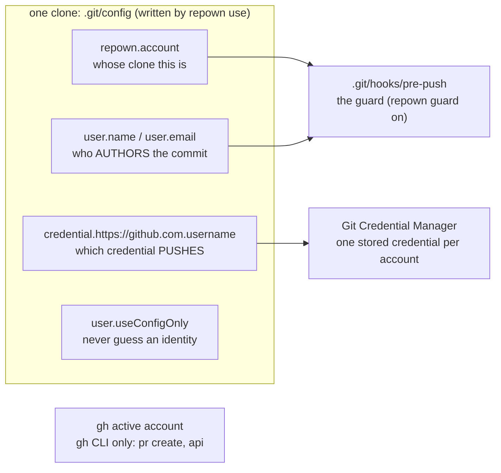
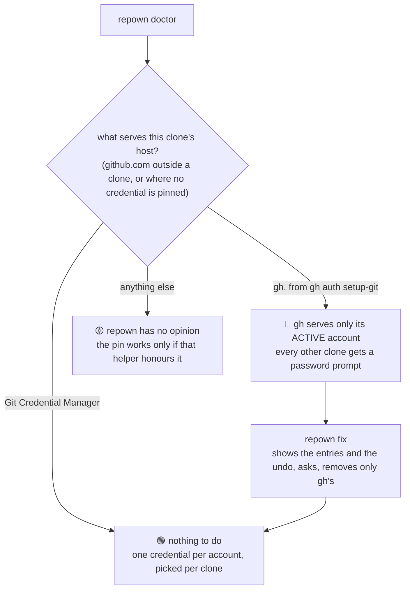
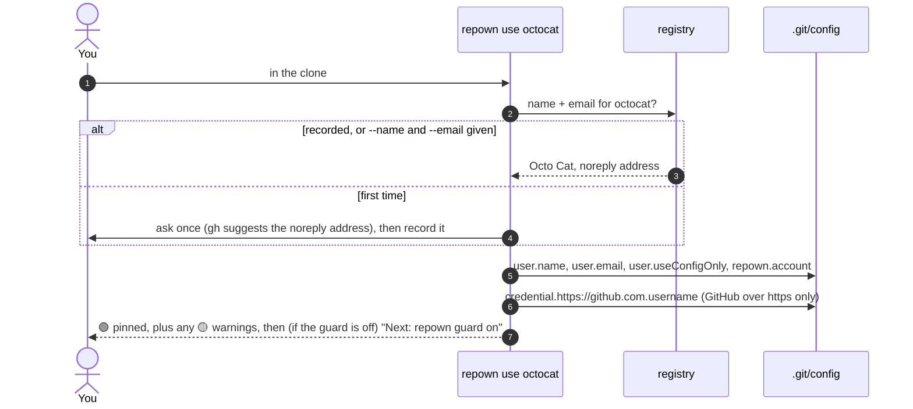
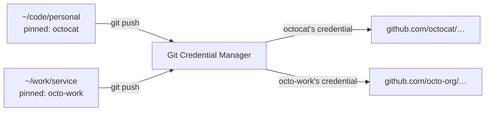
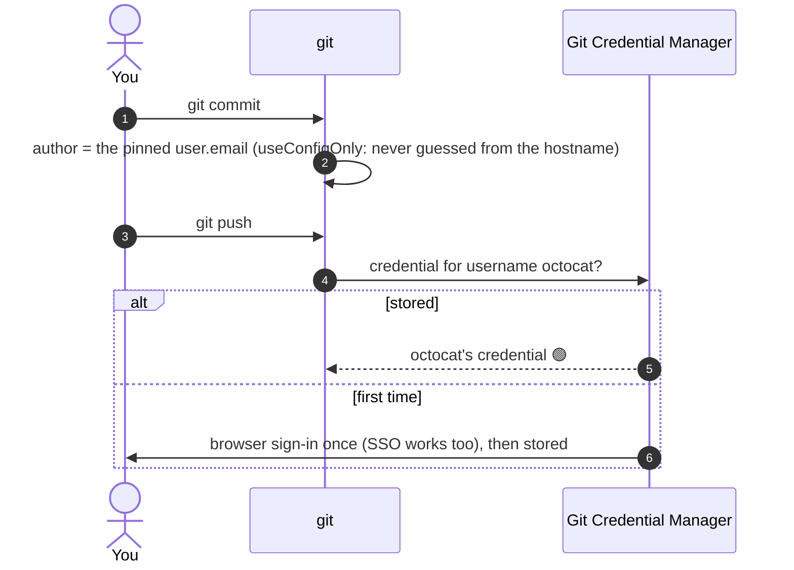
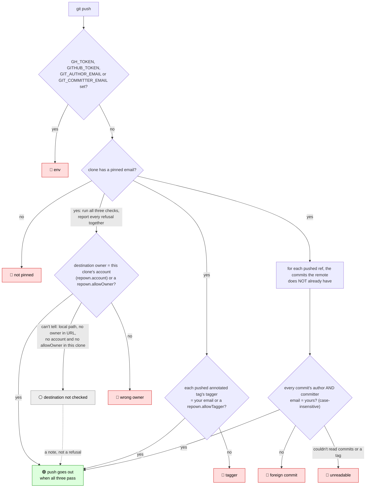
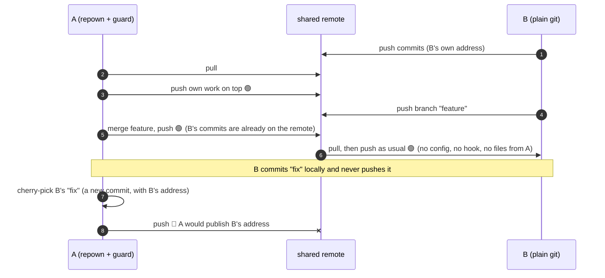
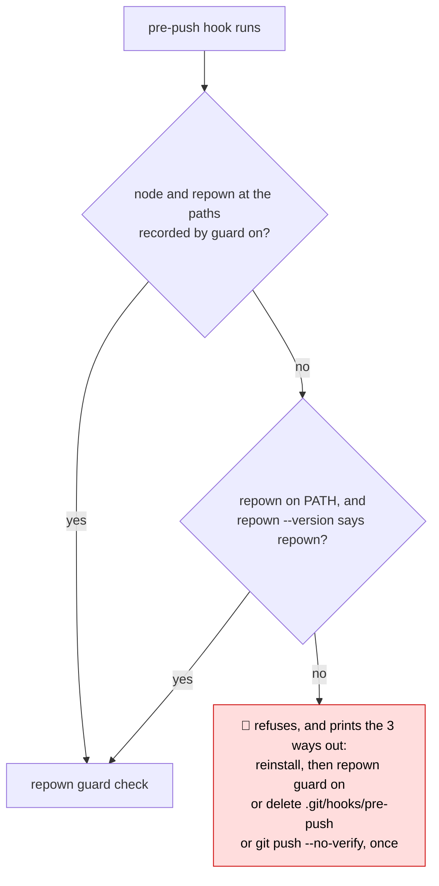
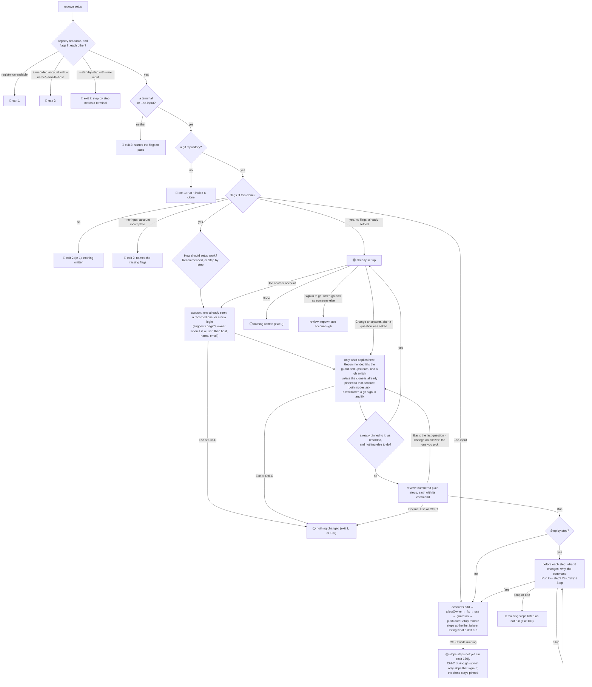
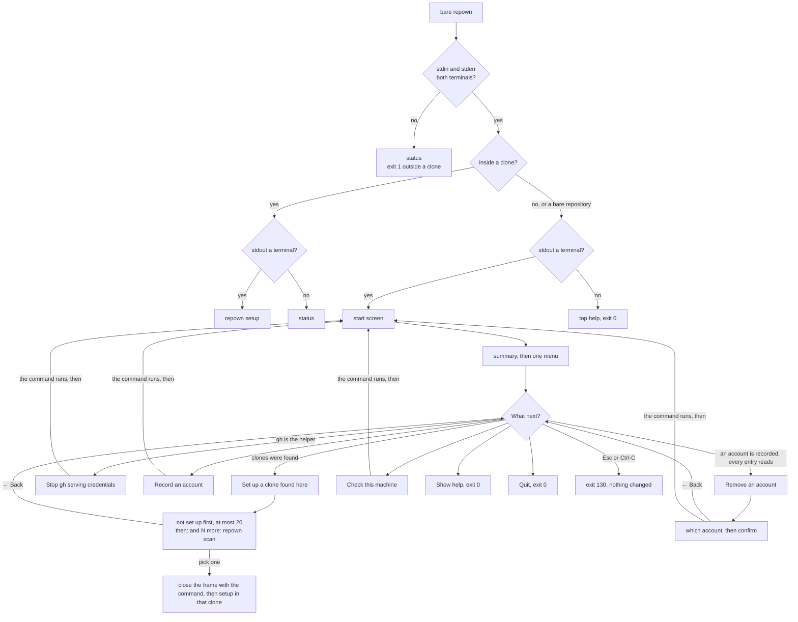

# How repown works

Every scenario, one card each. Read the headline, and click **Show how** when you want
the diagram and the detail. The reasons behind each rule are in
[decisions/](decisions/README.md), one ADR each.

**In three lines:** each clone is pinned **once** to one account. Moving between
accounts is just `cd`. A `pre-push` guard checks every commit before it leaves.

🟢 passes · 🔴 refused · 🟡 warns · ⚪ not checked (always said out loud, never silent)

## The picture: three things decide who you are


```mermaid
flowchart LR
  subgraph clone["one clone: .git/config (written by repown use)"]
    ID["user.name / user.email<br/>who AUTHORS the commit"]
    CRED["credential.https://github.com.username<br/>which credential PUSHES"]
    ACC["repown.account<br/>whose clone this is"]
    UCO["user.useConfigOnly<br/>never guess an identity"]
  end
  CRED --> GCM["Git Credential Manager<br/>one stored credential per account"]
  GH["gh active account<br/>gh CLI only: pr create, api"]
  HOOK[".git/hooks/pre-push<br/>the guard (repown guard on)"]
  ACC --> HOOK
  ID --> HOOK
```

Three things decide who you are: who authors commits (`user.name`/`user.email`), which
account pushes (the `credential…username` key), and who gh acts as. `repown.account`
records whose clone it is, for the guard.

Inside a clone, repown writes only `.git/config` and the pre-push hook, and git never
pushes either. Outside it, repown writes its account registry. Two commands go further,
only when you run them: `repown fix` removes gh's helper entries from your git config
(after showing them), and `repown use --gh` switches gh's active account. The full list:
[What repown writes](CONFIGURATION.md#what-repown-writes).

## Find your case

| I want to… / What happened? | Card |
| --- | --- |
| Be guided through it, one question at a time | [13](#13-guided-setup) |
| Run `repown` outside a clone | [14](#14-outside-a-clone) |
| Set up a new machine | [1](#1-set-up-the-machine) |
| Save an account once, use it everywhere | [2](#2-remember-an-account) |
| Make a clone belong to an account | [3](#3-pin-a-clone) |
| Use Azure DevOps, SSH or another host | [3](#3-pin-a-clone) |
| Work in account X, then Y, then Z | [4](#4-switch-accounts) |
| Check who I am in this clone | [5](#5-check-where-you-are) |
| Get asked for a password on push | [1](#1-set-up-the-machine) (gh is the helper), [5](#5-check-where-you-are) (no helper) |
| Do my first push | [6](#6-commit-and-first-push) |
| Push failed right after signing in (SSO) | [6](#6-commit-and-first-push) |
| Understand what the guard checks | [7](#7-push-what-the-guard-checks) |
| Fix a push the guard refused | [8](#8-push-refused-and-the-fix) |
| Work with a teammate who doesn't use repown | [9](#9-a-teammate-without-repown) |
| Use husky, or another pre-push hook | [10](#10-other-hook-tools) |
| Audit my clones, re-point one, or move to a new machine | [11](#11-audit-re-point-move-machines) |
| Uninstall repown, or fix "repown cannot be found" | [12](#12-uninstall-or-repown-missing) |

---

### 1. Set up the machine

**Once per machine.** `repown doctor` checks which program hands git your sign-in (the
*credential helper*), then lists every account repown, GCM or gh knows. 🟢 Git
Credential Manager (GCM) needs nothing more. 🔴 If gh has become the helper, run `repown fix`.

<details><summary>Show how</summary>

```
repown doctor · how this machine signs in to git hosts

This machine
  helper         manager
  GCM            git-credential-manager
  gh active      octo-work

Accounts
  octocat        (this clone)  git: not signed in yet (the first push signs in) · gh: not signed in
  octo-work      not recorded by repown · git: stored · gh: active

  Credentials come from Git Credential Manager, which stores one per
  account and picks per repository from credential.<url>.username. No
  switching is needed for git, and `gh auth switch` affects the CLI only.

  If a push fails although the account is stored, the org may need SSO
  authorization: authorize it in the org's SSO settings on github.com

ready: each clone signs in as its own account through Git Credential Manager
```

| Cell | Means |
| --- | --- |
| `git: stored` | GCM is the helper and holds a sign-in for this GitHub account |
| `git: stored in Git Credential Manager, which git isn't using` | GCM holds a sign-in, and git's helper is not GCM |
| `git: not signed in yet (the first push signs in)` | GCM is the helper, the store was read, and this account is not in it |
| `git: unknown` | GCM is missing, its store could not be read, or another helper serves pushes and this account is not stored |
| `git: your host's own sign-in` | The account's host is not GitHub, so no credential is pinned ([ADR-009](decisions/ADR-009-hosts-claim-only-measured.md)). No gh cell |
| `gh: active` / `signed in` / `not signed in` | gh acts as this account, knows it, or was queried and does not have it |
| `gh: unknown` | gh could not be queried. One WARN says why |
| `gh active` shows `not installed` | gh is absent. Said once, on that line, not on every account |
| `(this clone)` | This clone is pinned to that account. Outside a clone, no marker |
| `not recorded by repown` | Only GCM or gh knows the account |
| `recorded: unknown` | The registry could not be read. One WARN says why |
| `none recorded, stored or signed in yet` | The registry, the store and gh were read and named nobody. Next: `repown setup` |
| `no accounts recorded or signed in to gh; Git Credential Manager isn't installed` | No rows. The registry and gh were read and named nobody, and GCM is not installed. Next: `repown setup` |

Recorded accounts stay in registry order; the others follow, alphabetically.
A failed registry, store or gh read is `unknown` in the cells that depend on
it, and one WARN per source. GCM not installed is the `GCM` line (`not found`),
not a second warning. When that also leaves the list with no rows, the line
above says why and points at `repown setup`. Under the list, when Git Credential
Manager is the helper, the report explains per-clone sign-in and then one sentence,
on every such run, because repown cannot see SSO authorization
([ADR-013](decisions/ADR-013-deliberately-not-done.md)):
`If a push fails although the account is stored, the org may need SSO authorization: authorize it in the org's SSO settings on <host>`.
`<host>` is the origin's host in a GitHub clone over HTTPS, and github.com anywhere else. The gh-helper and unknown-helper
screens do not repeat it; they name their own problem. On Windows the clone path
in status and the GCM path here use backslashes. Elsewhere a path is shown as it
was read ([ADR-023](decisions/ADR-023-status-and-doctor-say-what-matters-first.md)).


```mermaid
flowchart TD
  D[repown doctor] --> Q{"what serves this clone's host?<br/>(github.com outside a clone, or where no credential is pinned)"}
  Q -->|Git Credential Manager| OK["🟢 nothing to do<br/>one credential per account, picked per clone"]
  Q -->|gh, from gh auth setup-git| BAD["🔴 gh serves only its ACTIVE account<br/>every other clone gets a password prompt"]
  Q -->|anything else| W["🟡 repown has no opinion<br/>the pin works only if that helper honours it"]
  BAD --> F["repown fix<br/>shows the entries and the undo, asks, removes only gh's"]
  F --> OK
```

| Variant | Command |
| --- | --- |
| See what `fix` would remove | `repown fix --dry-run` |
| No terminal, or a script | `repown fix --yes` |
| Undo `fix` | `gh auth setup-git` |
| Setting in the system scope | re-run `repown fix` in an elevated shell |
| `GCM` shows `not found` | install [Git Credential Manager](https://github.com/git-ecosystem/git-credential-manager/blob/main/docs/install.md) (Git for Windows includes it), then run `repown doctor` again |
| `helper` shows `none configured` | `git credential-manager configure` makes GCM git's helper, then run `repown doctor` again |
| `store  no accounts stored yet` | nothing: expected before the first push |

`doctor` exits 1 only when gh is the helper. The closing line is on stderr, after a blank line:

- Git Credential Manager, and the store holds an account: `ready: each clone signs in as its own account through Git Credential Manager`
- Git Credential Manager, and the store was read and is empty: `ready · no accounts stored yet: the first push signs in once`
- gh is the helper: `1 problem: gh answers git's sign-in requests: run repown fix`
- any other helper, or none: `unchecked: repown can't tell whether <helper> honours the per-clone pin` (`nothing` when none is set)

When the registry, the store or gh could not be read, its WARN is above and the verdict
adds ` · 1 warning` (or `N warnings`), as status counts its warnings.

In a clone repown pins no credential for (an SSH remote, Azure DevOps, another host), the
report opens with that clone: why origin gets no pin, read from its configured URL, and the
helper that serves that URL, named with no verdict. Then it reports on the machine for
github.com, as outside a clone: no account row is marked `(this clone)`, and a verdict that
passes starts `for github.com, `. gh serving github.com still fails, with exit 1.

```
This clone
  sign-in        origin is on Azure DevOps, so no credential is pinned here
  helper         manager

This machine, for github.com
  helper         manager
```

The reason is `origin is an SSH URL` (with no helper line: SSH asks none), `origin is not an
HTTPS URL` (GitHub over `http://` or `git://`), or `origin is not on GitHub`. A clone with no
origin, or one whose origin is a local path, reads as outside a clone.

**Why:** switching gh's account moves the password prompt to your other account's
clones rather than fixing it ([ADR-001](decisions/ADR-001-credential-manager-not-gh.md)).
</details>

### 2. Remember an account

**Once per account.** Record its commit name and email once, and every `repown use`
after that is one word.

<details><summary>Show how</summary>

```
repown accounts add octocat              # asks; with gh signed in, suggests <id>+octocat@users.noreply.github.com
repown accounts add octocat --name "Octo Cat" --email octocat@users.noreply.github.com
repown accounts add octo-work --host azdo
repown accounts list
repown accounts remove octocat           # clones already pinned keep their identity
```

The suggestion is looked up only for a login spelled the way GitHub spells one (letters,
digits, `-` and `_`): anything else, such as `../user` or `a.b`, is recorded as typed with
nothing suggested, so no other account's profile is ever offered. A profile name with
control or bidi characters is dropped, never shown or saved.

The registry stores a name, an email and a host per account, never a secret, outside
every repository ([where](CONFIGURATION.md#the-account-registry)). Run `add` again to
change an account; pinned clones keep the old values until you `repown use` it again.
Without a terminal, `add` can't ask: pass `--name` and `--email`.

When `add` asks, it looks the login up on GitHub first. If github.com has no account by that
name, it says so before asking (`WARN  accounts   github.com has no account named octocat:
check the spelling (recording it anyway)`), and an organisation gets the same kind of line.
It still records: offline, or behind a refused lookup, it says nothing.
</details>

### 3. Pin a clone

**Once per clone.** `repown use <account>` writes the identity into `.git/config`. 🟢

<details><summary>Show how</summary>


```mermaid
sequenceDiagram
  autonumber
  actor You
  participant R as repown use octocat
  participant Reg as registry
  participant G as .git/config
  You->>R: in the clone
  R->>Reg: name + email for octocat?
  alt recorded, or --name and --email given
    Reg-->>R: Octo Cat, noreply address
  else first time
    R->>You: ask once (gh suggests the noreply address), then record it
  end
  R->>G: user.name, user.email, user.useConfigOnly, repown.account
  R->>G: credential.https://github.com.username (GitHub over https only)
  R-->>You: 🟢 pinned, plus any 🟡 warnings, then (if the guard is off) "Next: repown guard on"
```

| Variant | What happens |
| --- | --- |
| `--gh`, already signed in | `gh auth switch`, so `gh pr create` acts as the same account |
| `--gh`, not signed in, in a terminal | `gh auth login` opens the browser. Before it, repown says this clone is already pinned, and that cancelling the browser (Ctrl-C) only skips the gh sign-in. Sign in there as this account (a private window helps). gh before 2.40.0 replaces an account, so repown refuses and tells you to upgrade |
| gh's question | Not asked when gh is already the helper. No helper: `When gh asks "Authenticate Git with your GitHub credentials?", type n and press Enter. Enter alone means Yes, and Yes makes gh answer git's sign-in requests for every repository.` Git Credential Manager: `When gh asks "Authenticate Git with your GitHub credentials?", press Enter (Yes): it also stores this sign-in in Git Credential Manager, so the first push won't ask again.` Another helper: that same sentence, naming the helper |
| `--gh`, gh becomes the helper | 🟡 when gh was not the helper before the login and is afterwards: `fix: repown fix` |
| `--gh`, no terminal, not signed in | 🟡 `<account> isn't signed in to gh`. `fix: gh auth login, then repown use <account> --gh`. No login |
| No terminal and no record | 🔴 stops and tells you to run `repown accounts add <account> …` |
| SSH remote | no credential key is written, because your SSH key decides; 🟡 `use` says credentials are not pinned for this remote |
| Azure DevOps or another host | identity and guard work; 🟡 credentials are not pinned ([ADR-009](decisions/ADR-009-hosts-claim-only-measured.md)). On Azure DevOps the owner is the organisation, so allow it with `repown.allowOwner` |
| Repo owned by an organisation | 🟡 prints the line that allows it ([card 5](#5-check-where-you-are)) |
| gh is still the credential helper | 🟡 `fix: repown fix`. Only where `use` pins a credential (GitHub over HTTPS) |
| No stored credential yet | the first push signs in once ([card 6](#6-commit-and-first-push)). Only where `use` pins a credential: an SSH remote or another host signs in its own way, so neither line is said |
| Unpushed commits by another address | 🟡 `N commits on <branch> not on any remote are by <addresses>; the guard will refuse them`, then `re-author it` (one commit) or `re-author them` (more): `git rebase <base> --exec "git commit --amend --no-edit --reset-author --allow-empty"`, or `git rebase --root --exec "git commit --amend --no-edit --reset-author --allow-empty"` when that commit has no parent, or pin that address (said only when one address made them all). `<base>` is the short hash of the parent of the oldest of those commits by another address, so your own commits before it are left alone. Up to three addresses, then `and N more`. Exit code unchanged. A detached HEAD says nothing. If those commits can't be read, the warning says so and gives no rebase command. Where no remote-tracking ref reaches the branch's push destination (the remote `git push` with no arguments uses), a line comes first and the rebase becomes conditional. A remote never fetched, or empty, or whose tracking refs can't be read: `origin has no remote-tracking refs, so some of these may already be on it (the guard skips any already on the branch you push to): git fetch origin, then repown use <account> to count again`, then `if origin has none of them, re-author them: …`. A remote that pushes to another URL than it fetches from: `origin pushes to another URL than it fetches from, …`. A remote whose fetch refspecs leave out the branch the push updates (a `--single-branch` clone, a `^refs/heads/<branch>` refspec): `origin's <branch> is not fetched here (remote.origin.fetch leaves it out), …`, with no command, since a fetch would not record it. Tracking refs are looked for where the remote's own refspecs write them. A URL: `this branch pushes to a URL, not a remote, …`, with `git config --local <key> <remote>` and a fetch when a remote has that host and path, and nothing to copy otherwise; the URL is not printed. A name with no remote: `this branch pushes to "<name>", which is not a remote here, …`. Those three continue `if it has none of them, re-author …`. A name starting with `-` gets no command ([ADR-025](decisions/ADR-025-unpushed-advice-behind-an-unknown-destination.md)) |

</details>

### 4. Switch accounts

**No command. Just `cd`.** Each clone already knows its account, so X, Y and Z work
side by side.

<details><summary>Show how</summary>


```mermaid
flowchart LR
  A["~/code/personal<br/>pinned: octocat"] -->|git push| GCM[Git Credential Manager]
  B["~/work/service<br/>pinned: octo-work"] -->|git push| GCM
  GCM -->|octocat's credential| H1[github.com/octocat/…]
  GCM -->|octo-work's credential| H2[github.com/octo-org/…]
```

Compare `gh auth switch`, which is **machine-wide** ([why that breaks clones](#1-set-up-the-machine)).
After `repown fix`, gh's active account affects only the gh CLI. To keep it in step with a clone, run
`repown use <account> --gh`.

To point this clone at an account already recorded, run `repown setup <account>`. That skips
the mode question and uses Recommended ([card 13](#13-guided-setup)). When gh would not open
a browser, `fix` does not apply, and origin belongs to the account or is already allowed,
it goes straight to the review. When origin belongs to someone else, it still asks first.
</details>

### 5. Check where you are

In a terminal (stdin, stdout and stderr), bare **`repown`** starts `repown setup` in a
clone, pinned or not. The sentence that says why is drawn inside setup's frame, right
after `┌  repown setup` and before `Reading this clone and this machine`. An unpinned
clone says `This clone isn't set up yet, so repown is starting setup (repown status shows its settings).`
A pinned clone says `Starting setup to check this clone (repown status shows its settings without asking anything).`
On a plain terminal that line is indented two spaces. Typed `repown setup` prints neither line.
Outside a clone, or in a bare repository, bare `repown` opens the start screen
([card 14](#14-outside-a-clone)). With stdout redirected, and stdin and stderr still
terminals, it prints status inside a clone and the top help outside one (exit 0). Without
a terminal on stdin or stderr, it is status (exit 1 outside a clone). **`repown status`**
prints all three identities and changes nothing.

<details><summary>Show how</summary>

Bare `repown` in an unpinned clone:

```
┌  repown setup
│
│  This clone isn't set up yet, so repown is starting setup (repown status
│  shows its settings).
│
◇  Reading this clone and this machine
```

A pinned clone:

```
┌  repown setup
│
│  Starting setup to check this clone (repown status shows its settings
│  without asking anything).
│
◇  Reading this clone and this machine
```

```
$ repown status

repown status · current settings of this clone
  ~/code/personal  (branch main)

This clone
  commits as     Octo Cat <octocat@users.noreply.github.com>
  pushes as      octocat
  account        octocat  (recorded)
  origin         octocat  (GitHub)
  upstream       origin/main
  push guard     on

This machine
  default        Octo Work <octo-work@example.invalid>
  helper         manager
  gh active      octo-work

OK    identity   this clone is pinned, and its credential mechanism honours it
NOTE  gh         active as "octo-work", so `gh pr create` here would act as that account. git pushes are unaffected; this only matters if you use gh here.
       fix: gh auth switch -u octocat

ready: commits and pushes use octocat · gh: optional (see the note above)
```

| You see | Meaning | Fix |
| --- | --- | --- |
| 🔴 `This clone sets no identity of its own` (`commits as` shows `NOT SET LOCALLY` or a `?`) | the clone sets no name or email of its own | `repown setup` (or `repown use <account>`) |
| 🔴 `No account is pinned` | a GitHub https clone with no push account; pushes use the machine default | `repown setup` (or `repown use <account>`) |
| 🔴 `gh is the git credential helper` | only gh's active account can push | `repown fix` |
| 🟡 `no credential helper is set` / `cannot tell whether it honours` | a GitHub https clone, and the helper isn't Git Credential Manager | `repown doctor` ([card 1](#1-set-up-the-machine)) |
| NOTE `gh active as "…"` | the gh CLI would act as another account; git pushes are unaffected. Printed after the identity line, and not counted as a warning | `gh auth switch -u <account>` when that account is signed in to gh; `repown use <account> --gh` when it is not |
| 🟡 `push …` (first among the warnings) | something will stop the next push: commits by another address the guard will refuse (no remote has them, or another remote has them but the destination lacks them), a sign-in in the push URL, an identity or token variable in this shell, `author.email` in config, a destination owner (said once, by the `origin` row when that fires), a diverged branch, a detached HEAD. Read only when status finds no problem; a missing upstream stays in the `upstream` field. With the guard off, what only the guard would refuse (commits by another address, an owner, `GH_TOKEN`) says `the guard is off, so …`, counts as a warning, and the clone is still `ready` | the line under it: the `git rebase` advice (or `repown reauthor`), `git config --unset …`, unset the variable, `git pull --rebase`; a sign-in in the push URL: `repown setup --repoint` ([card 8](#8-push-refused-and-the-fix)) |
| 🟡 `gh could not be queried` | who `gh pr create` acts as is unknown | `gh auth status` |
| 🟡 `origin belongs to "octo-org"` | an organisation repository | `git config --local --add repown.allowOwner octo-org` |
| 🟡 `guard off` | pushes are not checked | `repown guard on` |
| 🟡 a pre-push hook repown did not write, or `core.hooksPath` | another tool owns the hook | [card 10](#10-other-hook-tools) |
| 🟡 `this clone has submodules` | each submodule is a clone of its own | `git submodule foreach "repown use <account> && repown guard on"` |
| 🟡 `this clone commits as …, but <account> is recorded as …` | the clone's identity drifted from the record | `repown use <account>` |
| 🟡 `the account registry could not be read` | this clone's account was not compared with the registry | `repown accounts list` |
| 🟢 `commit identity is pinned; its credentials are left to …` | a host where repown doesn't pin credentials, or a helper other than Git Credential Manager (see the 🟡 helper row) | nothing on other hosts; on GitHub, `repown doctor` |
| `pushes as not pinned by repown on …` | a host where credentials aren't pinned | nothing: expected |
| `account … (not in this machine's registry)` | pinned by hand or on another machine | `repown accounts add <account> --name "..." --email "..."` |
| `origin no remote` | nothing to push to yet | nothing |
| `upstream origin/<branch>` | this branch tracks that remote branch | nothing |
| `upstream none yet: git push -u origin <branch>` | the branch has no upstream | `git push -u origin <branch>` |
| `upstream set on the first push (push.autoSetupRemote)` | git will set the upstream on the first push | nothing |
| (no `upstream` field) | detached HEAD, or no remote | nothing |

🔴 rows exit 1; 🟡 rows alone exit 0. The NOTE row is not a warning. With no
problems, stderr ends with `ready: commits and pushes use <account>` where this
host's credentials are pinned, or `ready: commits use <account>; pushes use this
host's own sign-in` where they are not (Azure DevOps, a local path, or any other
remote repown does not pin). ` · N warning(s)` follows when there are warnings;
the NOTE is not in that count. When the NOTE is the only finding, the line is
` · gh: optional (see the note above)`. When something will stop the next push, it ends
`the next push will fail: <the first> (and N more above)` instead, and still exits 0
([ADR-026](decisions/ADR-026-setup-says-what-blocks-the-next-push.md)). With a problem it ends with a count
(`1 problem, 2 warnings`), adding `: run repown setup` when an identity problem
is among them. A gh query that could not be run stays a warning. On Windows the
clone path uses backslashes; elsewhere it is shown as git printed it
([ADR-023](decisions/ADR-023-status-and-doctor-say-what-matters-first.md)).
Outside a clone,
`repown status` prints `Not a git repository` and exits 1. Bare `repown` does that only
when stdin or stderr is not a terminal. With stdout redirected, and the other two still
terminals, it prints the top help and exits 0. In a terminal it opens the start screen
([card 14](#14-outside-a-clone)). A bare repository takes that same path.

</details>

### 6. Commit and first push

**Commits use the pinned identity. On GitHub over https, the first push signs in once per
account, and never again;** on SSH or other hosts, your usual sign-in applies. 🟢

<details><summary>Show how</summary>


```mermaid
sequenceDiagram
  autonumber
  actor You
  participant Git as git
  participant GCM as Git Credential Manager
  You->>Git: git commit
  Git->>Git: author = the pinned user.email (useConfigOnly: never guessed from the hostname)
  You->>Git: git push
  Git->>GCM: credential for username octocat?
  alt stored
    GCM-->>Git: octocat's credential 🟢
  else first time
    GCM->>You: browser sign-in once (SSO works too), then stored
  end
```

**Push failed just after signing in?** Your organisation may use SSO, and the new
credential isn't authorized for it yet. Authorize it in the organisation's SSO settings on
GitHub, then push again. repown can't detect this in advance; when Git Credential
Manager is the helper, `repown doctor` reminds you of this on every run.
</details>

### 7. Push: what the guard checks

**`repown guard on`** installs the hook. Every push runs these checks in this order.
It checks every commit being pushed, so a commit made before you pinned the clone is
still caught.

<details open><summary>Show how</summary>


```mermaid
flowchart TD
  P[git push] --> E{GH_TOKEN, GITHUB_TOKEN,<br/>GIT_AUTHOR_EMAIL or GIT_COMMITTER_EMAIL set?}
  E -->|yes| X1[🔴 env]
  E -->|no| I{clone has a pinned email?}
  I -->|no| X2[🔴 not pinned]
  I -->|"yes: run all three checks,<br/>report every refusal together"| O{"destination owner = this clone's account<br/>(repown.account) or a repown.allowOwner?"}
  I -->|yes| T{"each pushed annotated tag's tagger<br/>= your email or a repown.allowTagger?"}
  I -->|yes| C["for each pushed ref, the commits the remote<br/>does NOT already have"]
  O -->|"can't tell: local path, no owner in URL,<br/>no account and no allowOwner in this clone"| N[⚪ destination not checked]
  O -->|no| X3[🔴 wrong owner]
  T -->|no| X4[🔴 tagger]
  C --> A{"every commit's author AND committer<br/>email = yours? (case-insensitive)"}
  A -->|no| X5[🔴 foreign commit]
  A -->|"couldn't read commits or a tag"| X6[🔴 unreadable]
  O -->|yes| OK["🟢 push goes out<br/>when all three pass"]
  N -.->|a note, not a refusal| OK
  T -->|yes| OK
  A -->|yes| OK
  classDef bad fill:#fdd,stroke:#c00,color:#000
  classDef good fill:#dfd,stroke:#080,color:#000
  classDef na fill:#eee,stroke:#888,color:#000
  class X1,X2,X3,X4,X5,X6 bad
  class OK good
  class N na
```

🟢 These always pass:
- your own commits, on a new branch or an existing one;
- deleting a branch, since it publishes nothing;
- re-pushing commits already on the branch you push to (its tip, when this clone has that
  commit) or on one of that remote's branches as of your last fetch: pulled work, merged
  branches.

- **Stop at once:** `env`, `not pinned`.
- **Reported together,** so one push shows everything to fix: wrong owner, tagger, foreign
  commits. Each 🔴 is explained in [card 8](#8-push-refused-and-the-fix).
- **Compared:** email addresses only, case-insensitive, never names. A variable set to an
  empty string counts as unset.
- **⚪ destination not checked** shows as a `WARN` line, and the push still goes out.
- **Never blocks:** credential problems, because a failed login publishes nothing;
  `repown` and `repown doctor` report those ([ADR-011](decisions/ADR-011-refuse-vs-warn.md)).
</details>

### 8. Push refused, and the fix

**Each refusal says what's wrong and how to fix it;** a commit refusal also lists the
commits. Nothing leaves until you fix it, or skip the check once. Before that push,
`repown use` warns and `repown setup`'s review notes the same fact, including in
Recommended mode, when the current branch has commits no remote has by another
address. Neither rewrites them. If those commits can't be read, that is said
rather than treated as clean ([card 3](#3-pin-a-clone)). Where no remote-tracking ref
reaches the branch's push destination, their count can be higher than what the guard
refuses, and they say so.

<details><summary>Show how</summary>

```
FAIL  guard      1 commit(s) bound for refs/heads/main were not authored as octocat@users.noreply.github.com, or were committed by someone else.
         2eccc0911  someone@example.invalid  someone else's commit

       These addresses become permanent once pushed.


Push stopped by the repown identity guard (above).
Override this one push with: git push --no-verify
```

| 🔴 Refusal | Typical cause | Fix |
| --- | --- | --- |
| **foreign commit**, yours | committed before pinning, or by an IDE with its own identity | `re-author it` or `re-author them`: `git rebase <base> --exec "git commit --amend --no-edit --reset-author --allow-empty"` (`git rebase --root --exec "git commit --amend --no-edit --reset-author --allow-empty"` when that commit has no parent), or pin that address; then push again. If the warning says the remote has no remote-tracking refs, `git fetch` it first: the guard only refuses what the remote doesn't have. Or let repown do it: `repown reauthor` fetches, then rewrites only what no remote has, from the oldest commit by another address on: your own commits after it are rewritten too, with their author dates reset. It keeps `refs/repown/backup/<branch>/<time>` (never removed: `git update-ref -d` it when done), prints the undo (`git reset --keep <backup>`) and never pushes. It also leaves alone what the destination's branches and tags reach (`git ls-remote`), so a pushed tag or a branch the fetch refspec leaves out is not rewritten. It refuses rather than guesses, for example on a merge in that range, uncommitted changes (files a sparse checkout leaves out don't count), identity variables, a destination it can't fetch, a destination branch this clone hasn't fetched, or a push that goes to another URL than the fetch ([ADR-026](decisions/ADR-026-setup-says-what-blocks-the-next-push.md)) |
| **foreign commit**, a teammate's | cherry-picked, rebased or fetched from their fork, and not on the remote yet | let them push it, then pull; don't re-author their work ([card 9](#9-a-teammate-without-repown)) |
| **wrong owner** `push goes to "…"` | an organisation repository, or the wrong remote | organisation: `git config --local --add repown.allowOwner octo-org` |
| **env** `GH_TOKEN is set` | a token or email variable overrides the identity | unset it, then push again |
| **not pinned** | the clone has no identity, e.g. after `repown off` | `repown use <account>`, or `repown guard off` |
| **tagger** | an annotated tag made under another address | re-tag; for a fork pushing upstream's tags: `git config --local --add repown.allowTagger <address>` |
| **unreadable** | a missing object, a tag it can't read, or history repown can't parse | `git fetch`, then push again; if it says it can't parse, inspect the commits yourself |
| ⚪ `destination not checked` | a local path, a URL with no owner, or no account or `repown.allowOwner` to compare | nothing: a note, not a refusal; `repown use` again pins the account |

**A fork's mirror branch** is a branch that only fast-forwards to upstream. Set
`git config --local repown.mirrorBranch master` and commits already on any remote stop
counting there, while a commit made here is still refused. Fetch upstream first, and
don't set it on a clone with a private remote.

`repown.allowOwner`, `repown.allowTagger` and `repown.mirrorBranch` count only in the
clone's own config, never global. A tag's tagger is checked even on a public commit,
because whether the tag itself is public can't be told offline.

**Skip the guard for one push:** `git push --no-verify`. Only do this when you mean to
publish those addresses.
</details>

### 9. A teammate without repown

**They need nothing, and they see nothing.** You can still pull, merge and push as
usual. 🟢

<details><summary>Show how</summary>


```mermaid
sequenceDiagram
  autonumber
  participant A as A (repown + guard)
  participant R as shared remote
  participant B as B (plain git)
  B->>R: push commits (B's own address)
  A->>R: pull
  A->>R: push own work on top 🟢
  B->>R: push branch "feature"
  A->>R: merge feature, push 🟢 (B's commits are already on the remote)
  R->>B: pull, then push as usual 🟢 (no config, no hook, no files from A)
  Note over A,B: B commits "fix" locally and never pushes it
  A->>A: cherry-pick B's "fix" (a new commit, with B's address)
  A-xR: push 🔴 A would publish B's address
```

Git never pushes `.git/config` or `.git/hooks`, so B's clone is untouched. The one
refusal is deliberate: the remote has never seen that commit, so A pushing it would
publish B's address from A's machine. This happens with a cherry-pick, a rebase, or a
fetch from B's fork. **If applying other people's patches is your daily work, as for a
maintainer, leave the guard off in that clone.** `repown use` still pins you. For a
whole team, use a server-side rule on author addresses.
</details>

### 10. Other hook tools

**repown never overwrites or deletes a hook it didn't write.** 🟡

<details><summary>Show how</summary>

| Situation | What repown does |
| --- | --- |
| A `pre-push` hook repown didn't write already exists | `guard on` and `guard off` leave it alone, say so, and exit 1 |
| `core.hooksPath` is set (husky, lefthook…) | never writes or deletes there; `guard on` refuses and `repown` warns, and both print the line below |
| A repown hook left in `.git/hooks` while `core.hooksPath` is set | `guard off` still removes it, so it can't come back when `core.hooksPath` is unset; if a repown hook is in that directory too, it says so instead of `off` |

To guard such a clone, call repown from that tool's `pre-push` hook, passing stdin through:

```sh
repown guard check --remote="$1" --url="$2"
```

If that hook is committed (husky's usually is), teammates without repown would get
"command not found" on every push. Skip it for them:

```sh
if command -v repown >/dev/null 2>&1; then repown guard check --remote="$1" --url="$2" || exit 1; fi
```

`repown` and `scan` still show such a clone's guard as `foreign`: they can't see what the
other tool's hook calls.

</details>

### 11. Audit, re-point, move machines

**Auditing never changes anything. Re-pointing takes one command.**

<details><summary>Show how</summary>

```
repown scan ~/code ~/work      # every clone: owner, host, identity, guard, email domains in history
repown scan --emails           # show exact addresses instead of domains (counts stay)
repown scan --format json      # the same facts as JSON, for scripts (ADR-014)
repown use octo-work           # re-point this clone to another account (or repown setup)
```

| Kept where | Survives a re-clone or a new machine? |
| --- | --- |
| `.git/config`: identity, `repown.*` keys | ❌ run `repown use` again |
| `.git/hooks/pre-push`: the guard | ❌ run `repown guard on` again |
| registry: name and email per account | ✅ on this machine (copy `accounts.json` to a new one: [where](CONFIGURATION.md#the-account-registry)) |
| OS credential store: one credential per account | ✅ on this machine |
| global `.gitconfig`: helper, default identity | ✅ untouched by repown, except `repown fix` |
| gh's `hosts.yml`: accounts and the active one (gh CLI only, not git) | ✅ untouched by repown, except `use --gh` |

Re-pointing keeps any `repown.allowOwner` lines for the old owner; remove one with
`git config --local --unset-all repown.allowOwner <owner>`.

- `scan` looks 3 levels deep (`--depth`), from the current folder if you name none.
- It skips `node_modules` and doesn't look inside a clone, so nested clones and
  **submodules are not listed**.
- It shows email domains with counts (the top 3, then `+N more`), not addresses, because
  this output gets pasted into chats.
- A count is how often an address appears as author or committer across every branch, tag
  and remote ref. It is not a number of commits.
- A `repown.mirrorBranch` is left out and marked `(excl. mirror)`.

| Column | Can read |
| --- | --- |
| identity | `pinned` · `INHERITED` (not pinned) · `commits only` (name and email, no account) |
| owner / host | owner and `github` · `azdo` · `generic`; `?` when no owner can be read; host `-` when origin isn't a URL (a local path); `no remote` and `-` without `origin` |
| guard | `on` · `off` · `foreign` (another tool's hook; counted as not guarded) |
| identities in history | `-` (empty history) · `(no domain)` · `unknown -- history could not be read` |

A directory `scan` can't open is reported, not skipped. The identity column is a fact,
not a verdict: a shared repository carries many addresses. The guard stops **new** wrong
addresses; it can't rewrite history.
</details>

### 12. Uninstall, or repown missing

**Turn the guard off before removing repown.** A guard that can't find repown refuses
rather than letting a push through unchecked.

<details><summary>Show how</summary>


```mermaid
flowchart TD
  H[pre-push hook runs] --> P{"node and repown at the paths<br/>recorded by guard on?"}
  P -->|yes| RUN[repown guard check]
  P -->|no| Q{"repown on PATH, and<br/>repown --version says repown?"}
  Q -->|yes| RUN
  Q -->|no| X["🔴 refuses, and prints the 3 ways out:<br/>reinstall, then repown guard on<br/>or delete .git/hooks/pre-push<br/>or git push --no-verify, once"]
  classDef bad fill:#fdd,stroke:#c00,color:#000
  class X bad
```

**Turned on through npx?** Then the hook records a copy in npm's `_npx` cache, and
`guard on` warns about it. When that folder is deleted, the hook refuses unless a
`repown` is on the PATH. Install it globally (`npm install -g repown`) and run
`repown guard on` again in that clone.

To uninstall, follow the [README's steps](../README.md#uninstall), and also:

- `scan` doesn't list submodules: turn the guard off in each guarded one too.
- A from-source install is removed with `npm unlink -g repown`.
- `repown off` leaves `repown.allowOwner`, `allowTagger` and `mirrorBranch`; to drop them
  all: `git config --local --remove-section repown`.

</details>

### 13. Guided setup

In a terminal, inside a clone, **`repown`** with no arguments starts this, whether or not
the clone is already set up. A line inside the frame, after the title, says why
([card 5](#5-check-where-you-are)). Typed `repown setup` does not print that line.
Outside a clone it opens the start screen
([card 14](#14-outside-a-clone)). A clone that is pinned intact and has nothing left for Recommended to do
opens on the "already set up" screen, before any question
([ADR-022](decisions/ADR-022-set-up-clone-opens-on-settled-screen.md)).
**`repown setup`** with no account and no flags does the same. Otherwise it asks how it
should work, then the questions that mode still needs, shows the commands it will run,
and runs them.
Each answer maps to an ordinary command (`accounts add`, `use`, `guard on`, `fix`) or to
a repo-local git line (`repown.allowOwner` from card 8, or `push.autoSetupRemote`), so
you can run the same thing yourself. If the clone needs nothing, it says so.

<details><summary>Show how</summary>


```mermaid
flowchart TD
  S[repown setup] --> G{"registry readable, and<br/>flags fit each other?"}
  G -->|registry unreadable| X0["🔴 exit 1"]
  G -->|a recorded account with --name/--email/--host| X4["🔴 exit 2"]
  G -->|--step-by-step with --no-input| X6["🔴 exit 2: step by step needs a terminal"]
  G -->|yes| T{"a terminal,<br/>or --no-input?"}
  T -->|neither| X2["🔴 exit 2: names the flags to pass"]
  T -->|yes| R{"a git repository?"}
  R -->|no| X1["🔴 exit 1: run it inside a clone"]
  R -->|yes| F{"flags fit this clone?"}
  F -->|no| X3["🔴 exit 2 (or 1): nothing written"]
  F -->|--no-input| C
  F -->|--no-input, account incomplete| X5["🔴 exit 2: names the missing flags"]
  F -->|yes, no flags, already settled| D
  F -->|yes| M{"How should setup work?<br/>Recommended, or Step by step"}
  M --> A["account: one already seen, a recorded one, or a new login<br/>(suggests origin's owner when it is a user; then host, name, email)"]
  A --> Q["only what applies here:<br/>Recommended fills the guard and upstream, and a gh switch<br/>unless the clone is already pinned to that account;<br/>both modes ask allowOwner, a gh sign-in and fix"]
  A -->|Esc or Ctrl-C| N
  Q -->|Esc or Ctrl-C| N
  Q --> K{"already pinned to it, as recorded,<br/>and nothing else to do?"}
  K -->|yes| D["🟢 already set up"]
  D -->|Done| DN["⚪ nothing written (exit 0)"]
  D -->|Use another account| A
  D -->|Sign in to gh, when gh acts as someone else| VG["review: repown use account --gh"]
  D -->|Change an answer, after a question was asked| Q
  K -->|no| V["review: numbered plain steps, each with its command"]
  V -->|Run| SB{"Step by step?"}
  SB -->|no| C["accounts add → allowOwner → fix → use → guard on → push.autoSetupRemote<br/>stops at the first failure, listing what didn't run"]
  SB -->|yes| SC["before each step: what it changes, why, the command<br/>Run this step? Yes / Skip / Stop"]
  SC -->|Yes| C
  SC -->|Skip| SC
  SC -->|Stop or Esc| NR["remaining steps listed as not run (exit 130)"]
  V -->|"Back: the last question · Change an answer: the one you pick"| Q
  V -->|Decline, Esc or Ctrl-C| N["⚪ nothing changed (exit 1, or 130)"]
  C -->|Ctrl-C while running| I["🟡 stops steps not yet run (exit 130).<br/>Ctrl-C during gh sign-in only skips that sign-in;<br/>the clone stays pinned"]
```

With `--no-input` there is no review and no "already set up" screen: the commands the
flags stand for run. A pin that would change nothing is left out, so a settled clone's
`git config --local --list` stays as it was. The gh advice a review would have shown is
printed after that run instead, because nothing else says it.

The account question lists the accounts already recorded and the GitHub logins repown can
already see (origin's owner, gh's accounts, Git Credential Manager's), then **a new
account**. An owner known to be an organisation is left out of the list, and an owner
whose kind couldn't be checked is listed but not suggested. It suggests origin's owner
when that owner is recorded and not known to be an organisation, and otherwise when
that owner is a user. A login seen only in gh or Git Credential Manager is listed,
never suggested.

| It asks | Only when | Becomes |
| --- | --- | --- |
| How should setup work? Recommended (default) or Step by step | unless `--step-by-step` is passed, or an `<account>` is given (that uses Recommended and skips this question). Not stored ([ADR-007](decisions/ADR-007-no-profile-store.md), [ADR-020](decisions/ADR-020-setup-leaves-clone-ready.md)). The flag is `--step-by-step` | nothing by itself |
| Which account should this clone belong to? | an account is recorded, or a GitHub login can already be seen. Default: the one pinned here if it is recorded, else origin's owner when it is recorded and not known to be an organisation, else origin's owner when that owner is a user, else the first other recorded account, else a new account | `use <account>`, after `accounts add` when the login is not recorded |
| The account's user name (login) | "a new account", or nothing recorded and nothing detected. Starts as origin's owner only when that owner is a user and is not recorded. Refused if already recorded | the `<account>` of `accounts add` |
| Where it's hosted, and your name and email as commits show them (on GitHub, with where to find your noreply address; this machine's default is shown, never filled in; when github.com has no account by that login, or it is an organisation, the name question says so first; else, when gh or Git Credential Manager is signed in as other github.com accounts only, it says that, and whether the name is just the login) | the login is new: "a new account", or one picked from the logins already seen | `accounts add <account> --name --email --host` |
| Also make this account gh's active account? (default No) | a GitHub clone (or one whose origin isn't a URL), gh knows the account, another is active. Recommended does not ask this when the clone is already pinned to that account: it answers No, and the review names the command (`gh auth switch -u <account>`, or `repown use <account> --gh` when gh does not list it) | `use --gh` |
| Sign in to gh as that account too? (default No) | the same, except gh does not know the account. Yes opens a browser; gh then acts as that account in every terminal. The line under it names gh's active account, or says gh isn't signed in. Recommended skips it the same way when the clone is already pinned to that account | `use --gh` |
| Push through origin instead of the URL set for this branch? (default Yes) | the branch pushes to a URL (from `branch.<name>.pushRemote`, `remote.pushDefault` or `branch.<name>.remote`) naming the same host and path as a remote here. A URL there can carry its own sign-in and is never fetched. The review shows the key and the remote, never the URL, and so does the run's "changed in this clone" (`(a URL) -> origin`). The flag is `--repoint` | `git config --local <key> <remote>` |
| Fetch origin first? (default Yes) | some unpushed commits are by another address, and the push destination is a remote with no remote-tracking refs (or becomes one by the step above). A clean clone never fetches. Prompts are off, as for `repown reauthor`; a failure prints `WARN fetch could not fetch origin (…)`, the destination stays unknown, and the rest of the steps run. The flag is `--fetch` | `git fetch <remote>` |
| This repository belongs to "octo-org". Let this clone push to it? (default Yes) | origin's owner isn't the account, and isn't allowed yet | `git config --local --add repown.allowOwner <owner>` |
| Turn on the push guard? (default Yes) | the guard is off, no other tool owns the hook, and `core.hooksPath` doesn't redirect hooks | `guard on` |
| Push branches without -u? (default Yes) | git is 2.37.0 or newer, and `push.autoSetupRemote` is not already true in any scope. The flag is `--auto-upstream`. On older git, or when `git --version` cannot be read, this is not asked and the review notes `git push -u origin <branch>` (the current branch, or `<branch>` when HEAD is detached) | `git config --local push.autoSetupRemote true` |
| Stop gh answering git's sign-in requests? (whole machine, default No) | a GitHub clone, gh is the helper, and `fix` finds its entries. Still asked in Recommended | `fix --yes` |
| Re-author your unpushed commits by old@example.invalid as octocat? (default No) | some unpushed commits carry an address other than the account's. Still asked in Recommended: only you know whether you made them. The step runs last, so every other step has run by then; a refusal (a merge in the range, uncommitted changes, a destination it can't fetch) stops setup with exit 1, and the clone keeps its commits. The flag is `--reauthor`, and with `--no-input` it is the confirmation (`reauthor --yes`), as `--fix` is for `fix --yes` | `reauthor --yes` |

**Recommended** answers Yes, and does not ask, the questions that only change this
clone and need nothing only the user knows: push through the remote instead of a URL,
fetch the destination first, turn the guard on, and push branches without `-u`. It also switches gh, without asking, when gh already lists the account
and this clone is not already pinned to it. Each of those is still a step in the
review, and Change an answer can open it. When the clone is already pinned to the
chosen account, Recommended does not ask about gh and answers No, so the review
names the command (`If you use gh here: …`). It still asks for the account, and for a new account
the host, name and email. It always asks, default Yes, when origin belongs to
someone other than the account. It still asks, default No, when signing in to gh
would open a browser and the clone is not already pinned to that account, when
`fix` would change the whole machine, and whether to re-author commits by another
address. **Step by step** asks every question. After Run, before each command, it shows what that step changes (the config
keys and values, or the gh action), why (the step's own sentence), and the command, then
asks `Run this step?` with Yes / Skip / Stop. Enter is Yes, except for `fix` and
`reauthor`, where Enter is Skip: one changes the whole machine and the other rewrites
commits, the same reason the review's Enter is Decline when either is one of the steps. Skip leaves that step unchanged and continues.
Stop, or Esc, runs nothing further and lists the steps that were not run.
`--no-input` does not use Recommended's answers: a question not given as a flag
is No. `--step-by-step --no-input` exits 2.

Before the guard question it says how many other people's email addresses are in this
repository's commits, or that it has none yet: the guard suits clones where you push only
your own commits ([ADR-005](decisions/ADR-005-guard-opt-in-per-clone.md)). When a step changes the whole machine (`fix`), Enter at the
review takes **Decline**.

Without a terminal (CI, a script): see [Scripts and CI](CONFIGURATION.md#scripts-and-ci).

**"Already set up" is shown only when all of these hold:**

- the clone is pinned to the account you chose, and that pin is not a new account;
- every key `use` writes holds exactly the recorded value, both in `.git/config` and in
  what git actually resolves (includes, worktree config, credential entries for the same
  URL spelt otherwise), so pinning again is left out of the plan;
- origin's owner is the account, or is already allowed;
- gh is nowhere in the credential-helper list;
- this run will not switch or sign in to gh;
- push branches without `-u` is not something this run will change. Answering No,
  or never being offered the question (git older than 2.37, or `git --version` could
  not be read), still counts. The screen then says
  `optional: push branches without -u: repown setup --auto-upstream` when git could
  still set it. Recommended answers Yes, so that clone is not already set up until the
  setting is on. The screen's `upstream` line is the tracked ref (for example
  `origin/main`) when there is one, otherwise
  `set on the first push (push.autoSetupRemote)` when that setting is on,
  otherwise the line is absent. That is what `repown status` shows, except status
  says `none yet` when neither applies;
- the guard is already on, or it is not repown's to turn on (another tool owns the
  hook, or `core.hooksPath` redirects hooks). Recommended would turn an ordinary off
  guard on, and that clone is not already set up;
- the plan is empty. A no-op `repown use` is not listed.

With no flags, that screen is the first thing setup shows, using the pinned account
and Recommended's answers. **Done** changes nothing (exit 0). **Use another account**
continues at the account question, in Recommended; Back returns to this screen.
**Sign in to gh as `<account>`** is offered only when gh acts as another account. It
reviews one step, `repown use <account> --gh`. When gh already lists the account, the
option is **Make `<account>` gh's active account**. **Re-author them as `<account>`** is
offered only when unpushed commits carry another address; it reviews one step,
`repown reauthor --yes`, whose Enter is Decline. **Change an answer** is not on this
first screen. Step by step can still reach the same screen after its questions, and
then Change an answer is there.

The owner setup, `status`, `use` and `scan` name ("origin's owner", the destination owner) is read
from the URL git pushes to, `git remote get-url --push`: `pushurl`, `pushInsteadOf` and
`insteadOf` applied, the same URL the pre-push hook gives the guard. The host shown with it
(`status`'s `(GitHub)`, `scan`'s `host`) comes from that same URL. With several push URLs, the
first is named; the guard checks each. A push straight to a URL is read after `insteadOf` only.
A username written into a `pushInsteadOf` URL isn't checked.

The credential pin follows the same rewrites. `credential.https://github.com.username` is set
when any URL git fetches or pushes origin with is GitHub over https (`git remote get-url --all`,
and again with `--push`): an SSH clone that pushes over https is pinned, and a clone whose
https URL an `insteadOf` sends over SSH is not. The helper `status`, `use`, `doctor` and setup
judge is the one serving that URL. `repown off` also removes the key of the URLs as configured,
so a rule added since `use` leaves nothing behind.

**Keys.** ↑/↓ choose, Enter confirms, Esc or Ctrl-C cancels (exit 130; with numbered
choices, Ctrl-C). Once there is a
question to go back to, each list ends with **← Back** (↑ from the first choice lands on
it; at a text question, type `<`). "Change an answer" lists the questions, with
**← Back to the review** last; the "already set up" screen has no Back. In a plain terminal
([when](CONFIGURATION.md#environment-variables)), or when the prompt library can't load
(it says so), the same questions come as numbered choices, and Back is plain **Back**. Decline,
Esc or Ctrl-C end with one line: nothing was changed, and you can run `repown setup` again
any time.

**Recommended,** in a clone of an organisation's repository: the mode question, the
account, whether this clone may push to that owner (default Yes), then the review.
The questions it did not ask are still steps.

```
◇  How should setup work?
│  Recommended fills in the answers that only change this
│  clone; Step by step asks each one
│  Recommended
│
◇  Which account should this clone belong to?
│  commits made here carry its name and email; on GitHub,
│  pushes from here also sign in as it
│  right now this clone isn't pinned to any account
│  octocat
│
◇  This repository belongs to "octo-org". Let this clone push to it?
│  Yes if you're a member of that organisation or a
│  collaborator on it; with No, the push guard refuses pushes
│  there. Saved in this clone only
│  Yes
│
◇  Review: nothing has changed yet ─────────────────────────────────╮
│                                                                   │
│  This clone will commit and push as octocat.                      │
│                                                                   │
│  When you choose Run:                                             │
│  1. Let this clone push to octo-org's repositories                │
│       git config --local --add repown.allowOwner octo-org         │
│  2. Pin this clone to octocat, and make it gh's active account    │
│       repown use octocat --gh                                     │
│  3. Turn on the push guard: each push is checked first            │
│       repown guard on                                             │
│  4. Push branches without -u: the first push sets the upstream    │
│     (this clone only)                                             │
│       git config --local push.autoSetupRemote true                │
│                                                                   │
│  These are ordinary commands: run them yourself, or in a script.  │
│  This clone's settings go in its .git/config, which is never      │
│  pushed.                                                          │
│                                                                   │
├───────────────────────────────────────────────────────────────────╯
```

**Step by step** asks each of those questions, and whether gh should act as this account
too. The same clone, after choosing Step by step and answering No to gh (the review follows,
as in the [README](../README.md#quick-start)):

```
┌  repown setup
│
◇  Reading this clone and this machine
│
◇  How should setup work?
│  Recommended fills in the answers that only change this
│  clone; Step by step asks each one
│  Step by step
│
◇  Which account should this clone belong to?
│  commits made here carry its name and email; on GitHub,
│  pushes from here also sign in as it
│  right now this clone isn't pinned to any account
│  octocat
│
◇  Also make this account gh's active account?
│  gh is GitHub's command-line tool: this changes the account
│  gh commands use, in every terminal; git is not affected
│  gh's active account is octo-work
│  No
│
◇  This repository belongs to "octo-org". Let this clone push to it?
│  Yes if you're a member of that organisation or a
│  collaborator on it; with No, the push guard refuses pushes
│  there. Saved in this clone only
│  Yes
│
◇  Turn on the push guard?
│  before each push, it checks that every commit is yours and
│  goes to the right place, and stops the push if not; turn it
│  off any time: repown guard off
│  only your email address is in this repository's commits
│  Yes
│
◇  Push branches without -u?
│  sets push.autoSetupRemote in this clone only, so the first
│  push of a branch without an upstream creates it on origin;
│  the guard still checks it
│  Yes
```

Its review pins with `repown use octocat` (no `--gh`) and adds, under the steps: `gh still
acts as octo-work, so gh pr create here would act as that account (git pushes are
unaffected). If you use gh here: gh auth switch -u octocat.`

**Run:** in Recommended, each step prints what it is, then the command and its own output.

```
└  Running the commands

       step 1 of 4: Let this clone push to octo-org's repositories
       $ git config --local --add repown.allowOwner octo-org
OK    origin     pushes to octo-org allowed in this clone

       ...

       step 3 of 4: Turn on the push guard: each push is checked first
       $ repown guard on
OK    guard      on -- every push is checked before it leaves
  /home/you/code/project/.git/hooks/pre-push

       step 4 of 4: Push branches without -u: the first push sets the upstream (this clone only)
       $ git config --local push.autoSetupRemote true
OK    upstream   branches without an upstream push without -u in this clone

       ✔ done: this clone is set up for octocat
       changed in this clone:
         user.name: (added) Octo Cat
         user.email: (added) octocat@example.invalid
         user.useConfigOnly: (added) true
         repown.account: (added) octocat
         credential.https://github.com.username: (added) octocat
         repown.allowOwner: (added) octo-org
         push.autoSetupRemote: (added) true
         push guard: off -> on
       changed on this machine:
         gh: octocat is now gh's active account (every terminal)
       check it any time: repown status (this clone), repown doctor (this machine)
```

The last line is only when gh still acts as someone else and the review did not already say so. The fix is the one `repown status` prints: `gh auth switch -u <account>` when gh already lists it, otherwise `repown use <account> --gh   (signs <account> in to gh)`. The review says the same thing (`gh still acts as <active>, so gh pr create here would act as that account (git pushes are unaffected). If you use gh here: gh auth switch -u <account>.` when gh already lists it, otherwise `If you use gh here: repown use <account> --gh (signs <account> in to gh).`), and that run does not print it again. With `--no-input` there is no review, so the line after the run is the one place it appears. The first push's sign-in is said by `use` when `use` runs. When the pin is left out and Git Credential Manager's store was read and does not list the account, the review says `No stored credential for <account> yet: the first push signs in once (your browser opens).`

`changed in this clone:` is what this run wrote in the clone, read before the first step and again after it (also after Stop, or after a step fails). A key that was unset is `(added)`; one that is gone is `old -> (removed)`. A key that did not change is left out. `repown.allowOwner` lists the values added or removed. The guard is `push guard: off -> on`. Only these config values are shown, never what a credential helper prints. When nothing in the clone changed, that block is the one line `nothing changed in this clone`. A settled clone whose pin was left out still says `done: this clone is set up for <account>`. `done` needs nothing left in the way of the next push, read again after the run: otherwise the line is `set up for <account>; the next push will fail: <first blocker> (and N more below)`, followed by each blocker's lines, and the exit code is unchanged ([ADR-026](decisions/ADR-026-setup-says-what-blocks-the-next-push.md)). Where stderr has colour, `done` leads with a green ✔ and the blocked line with a yellow ▲ (`+` and `!` where Unicode can't be drawn), each blocker sits two columns deeper, and the commands (in the review, on `$ ` lines and under `not run:`) are cyan. Without colour none of that is added ([ADR-027](decisions/ADR-027-the-wizard-decorates-only-where-it-draws-colour.md)). The blockers: commits by another address the guard will refuse (also those another remote has but the push destination lacks), a sign-in carried by the push path (named by config key, never shown), `GIT_AUTHOR_EMAIL` / `GIT_COMMITTER_EMAIL` / `GH_TOKEN` / `GITHUB_TOKEN` set, `author.email` / `committer.email` in config, a destination owner the guard refuses, a branch diverged from its tracked ref on the destination, no upstream where a plain `git push` needs one, and a detached HEAD. The review lists them first among its notes.

Recording an account is not in the clone. That run adds a separate section:

```
       changed on this machine:
         this machine's account registry: added octocat
```

When a `use --gh` step ran and gh's active account afterwards is that account, the same section adds `gh: octocat is now gh's active account (every terminal)`. `use` has already said so; this line is the run's summary, not a second copy of that sentence.

**Step by step, after Run.** The same steps, one confirmation each. Enter takes Yes. The lines under the step are the config keys and values it writes (or the gh action), then why, then the command. Nothing secret is shown: config values only.

```
       step 2 of 4: Pin this clone to octocat: its commit name, email and push sign-in
│
│  user.name = Octo Cat
│  user.email = octocat@example.invalid
│  user.useConfigOnly = true
│  repown.account = octocat
│  credential.https://github.com.username = octocat
│
│  Pin this clone to octocat: its commit name, email and push sign-in
│  $ repown use octocat
│
◆  Run this step?
│  ● Yes
│  ○ Skip
│  ○ Stop
│  ↑/↓ to navigate • Enter: confirm
└
```

`use --gh` adds one line: `gh: switch the active account to octocat`, or `gh: sign in as octocat (opens a browser)`. The guard's line is `pre-push hook: <path> runs repown guard check` (or `this clone's pre-push hook` when the path isn't known). Allowing an owner is `repown.allowOwner += octo-org`. Pushing branches without `-u` is `push.autoSetupRemote = true`. Recording an account is `this machine's account registry: octocat = Octo Cat octocat@example.invalid`. `fix` lists the lines it removes, and Enter there is Skip.

Skip does not run that step. The closing lines name every skipped step, and say the clone is set up only when the pin ran:

```
       ✔ done: this clone is set up for octocat
       skipped: Turn on the push guard: each push is checked first
       changed in this clone:
         user.name: (added) Octo Cat
         user.email: (added) octocat@example.invalid
         user.useConfigOnly: (added) true
         repown.account: (added) octocat
         credential.https://github.com.username: (added) octocat
       check it any time: repown status (this clone), repown doctor (this machine)
```

Stop, or Esc, prints `not run:` and the commands that did not get their turn. Exit 130.

**Already set up:** run it again in a clone that needs nothing. If something would still make the next push fail, `Nothing needs to change.` becomes `Its settings need no change, but the next push will fail:` and the blockers follow.

```
◇  This clone is already set up ─────────────────────────────────────╮
│                                                                    │
│  commits as  Octo Cat <octocat@users.noreply.github.com>           │
│  pushes as   octocat                                               │
│  guard       on: every push is checked before it leaves            │
│  upstream    origin/main                                           │
│                                                                    │
│  Nothing needs to change.                                          │
│                                                                    │
│  Checked: the settings git uses here are octocat's, as recorded.   │
│  See it any time: repown status (this clone), repown doctor (this  │
│  machine)                                                          │
│                                                                    │
├────────────────────────────────────────────────────────────────────╯
│
◆  What now?
│  ● Done (change nothing)
│  ○ Use another account
│  ↑/↓ to navigate • Enter: confirm
└
```

**Done** writes nothing. **Use another account** asks which account, then the rest of
Recommended. When gh acts as someone else, a third option is **Sign in to gh as
octocat** (or **Make octocat gh's active account** when gh already lists it). Choosing
it reviews `repown use octocat --gh` and nothing else. With unpushed commits by another
address, **Re-author them as octocat** is offered too, and reviews `repown reauthor --yes`
alone. The box then says
`If you use gh here, choose "Sign in to gh as octocat" below.`
(or `Make octocat gh's active account` when gh already lists it).
The `upstream` line is the tracked ref (for example `origin/main`) when there is
one, otherwise `set on the first push (push.autoSetupRemote)` when that setting
is on, otherwise nothing. `repown status` shows the same value, and adds
`none yet` when neither applies.

</details>

### 14. Outside a clone

In a terminal, outside a clone or in a bare repository, bare `repown` opens a start
screen. It reads this folder, says what it found, and offers the next command. Nothing
changes until you pick one
([ADR-024](decisions/ADR-024-bare-repown-outside-a-clone-opens-a-start-screen.md)).

<details><summary>Show how</summary>


```mermaid
flowchart TD
  B["bare repown"] --> I{"stdin and stderr<br/>both terminals?"}
  I -->|no| S["status<br/>exit 1 outside a clone"]
  I -->|yes| C{"inside a clone?"}
  C -->|yes| O1{"stdout a terminal?"}
  O1 -->|yes| SU["repown setup"]
  O1 -->|no| S2["status"]
  C -->|"no, or a bare repository"| O2{"stdout a terminal?"}
  O2 -->|yes| HOME["start screen"]
  O2 -->|no| HELP["top help, exit 0"]
  HOME --> SUM["summary, then one menu"]
  SUM --> MENU{"What next?"}
  MENU -->|clones were found| SET["Set up a clone found here"]
  SET --> LIST["not set up first, at most 20<br/>then: and N more: repown scan"]
  LIST -->|pick one| RUN["close the frame with the command, then setup in that clone"]
  LIST -->|"← Back"| MENU
  MENU -->|gh is the helper| FIX["Stop gh serving credentials"]
  MENU --> ADD["Record an account"]
  MENU -->|"an account is recorded, every entry reads"| REM["Remove an account"]
  REM --> WHICH["which account, then confirm"]
  WHICH -->|"← Back"| MENU
  MENU --> DOC["Check this machine"]
  FIX & ADD & WHICH & DOC -->|"the command runs, then"| HOME
  MENU --> SH["Show help, exit 0"]
  MENU --> QUIT["Quit, exit 0"]
  MENU -->|Esc or Ctrl-C| ESC["exit 130, nothing changed"]
```

With colour on, the screen looks like this. The summary is inside the frame, and there
is no blank line before **What next?**. The highlighted row shows its hint in parentheses.
The title is a cyan badge, each summary value is bold cyan, and the hand-over line
(`$ repown ...`) is cyan. On a terminal that can't draw Unicode, clack draws ASCII
stand-ins (`T` for `┌`, `|` for `│`, `*` for `◆`, `>` for the selected `●`). No variable needs
setting ([ADR-027](decisions/ADR-027-the-wizard-decorates-only-where-it-draws-colour.md)).

```
┌  repown · not a clone: /home/octocat/code
│
◇  Reading this folder
│
│  Accounts   2 recorded: octo-work, octocat
│  Helper     gh serves git's credentials: run repown fix
│  Clones     3 below this folder: 2 not set up, 1 set up
│
◆  What next?
│  ● Set up a clone found here (2 not set up)
│  ○ Stop gh serving credentials
│  ○ Record an account
│  ○ Remove an account
│  ○ Check this machine
│  ○ Show help
│  ○ Quit
│  ↑/↓ to navigate • Enter: confirm
└
```

A plain terminal (colour off on stderr, `TERM=dumb`, or the prompt library can't load)
lists the same choices numbered, hints included
([when](CONFIGURATION.md#environment-variables)). The summary above the question is
indented two spaces:

```
  Accounts   2 recorded: octo-work, octocat
  Helper     gh serves git's credentials: run repown fix
  Clones     3 below this folder: 2 not set up, 1 set up
What next?
  1) Set up a clone found here  -- 2 not set up
  2) Stop gh serving credentials  -- repown fix
  3) Record an account  -- repown accounts add
  4) Remove an account  -- repown accounts remove
  5) Check this machine  -- repown doctor
  6) Show help
  7) Quit
  choice [1]: 
```

**Summary.** Each line is a label padded to 10, then one space, then the value. With
arrow keys the line is in the frame, after the gutter. On a plain terminal it is
indented two spaces.

| Line | When | Value |
| --- | --- | --- |
| `Accounts` | the registry was read | `none recorded`, or `2 recorded: octo-work, octocat` (the logins, sorted) |
| `Accounts` | the file has entries repown cannot read | `1 recorded, 1 unreadable in <path>: run repown accounts list`, or, when nothing in it could be read, `1 unreadable in <path>: run repown accounts list`. The menu stays, without Remove an account (`accounts remove` won't rewrite a file it can't fully read) |
| `Accounts` | the registry could not be read | `could not read` and that path. Never `none` |
| `Helper` | gh's per-host helper entries, the ones `repown fix` removes, are present | `gh serves git's credentials: run repown fix` |
| `Clones` | clones were found, up to 2 levels below | `3 below this folder: 2 not set up, 1 set up` |
| `Clones` | none were found | `none below this folder (2 levels)` |

A control character in an account name, or in the folder in the title, is shown as an
escape, the same way a clone's name is. Set up means the clone already has its own
identity, and a pinned account where pushes need one. The Helper line, and **Stop gh
serving credentials**, appear only when those entries are present.

**Discovery** looks 2 levels down. It skips dot-directories, `node_modules`, and on
Windows `AppData`. A folder it cannot list is skipped with no message. A directory
whose `.git` git refuses is not listed. The start screen searches inside it with the
levels still left, at any depth, not only in this folder. When no levels are left, it
stops. In a bare repository the start screen does not search for clones, and the
clones line is `none below this folder (2 levels)`. `repown scan`
still warns `could not read <path> -- not scanned`, and its own walk is unchanged.

**No clones found.** The menu has no **Set up a clone found here**. The summary and the
note are inside the frame:

```
┌  repown · not a clone: /home/octocat/code
│
◇  Reading this folder
│
│  Accounts   none recorded
│  Clones     none below this folder (2 levels)
│
▲  cd into a clone (or git clone one), then run repown
│
◆  What next?
│  ● Record an account (repown accounts add)
│  ○ Check this machine
│  ○ Show help
│  ○ Quit
│  ↑/↓ to navigate • Enter: confirm
└
```

A plain terminal prints the summary and the note indented two spaces, with no blank
line between them:

```
  Accounts   none recorded
  Clones     none below this folder (2 levels)
  cd into a clone (or git clone one), then run repown
```

**Set up a clone found here.** Only when at least one clone was found. The list is the
clones, not set up first, each as its path relative to this folder, with `not set up`
or `set up`. A control character in that label is shown as an escape; setup still
receives the path itself. At most 20 are listed. When more were found, a line above
the list names the rest, for example `and 5 more: repown scan`. That line is in the
frame too. On a plain terminal it is indented two spaces. **← Back** returns to the menu.

```
│
│  and 5 more: repown scan
│
◆  Which clone?
```

```
Which clone?
  1) extra  -- not set up
  2) need  -- not set up
  3) ready  -- set up
  4) ← Back
  choice [1]: 
```

Picking one closes the start screen's frame with the command, then setup opens its own
frame in that clone. Setup's exit code is repown's. The line about starting setup is
only for bare `repown` inside a clone ([card 5](#5-check-where-you-are)).

```
└  $ repown setup --cwd /home/octocat/code/need

┌  repown setup
│
◇  Reading this clone and this machine
```

On a plain terminal the command is its own line:
`$ repown setup --cwd /home/octocat/code/need`.

**Stop gh serving credentials** closes the frame with `└  $ repown fix`, then runs
`repown fix`, which asks its own confirmation.
**Check this machine** closes the frame with `└  $ repown doctor`, then runs
`repown doctor`. **Show help** closes the frame with `└  $ repown --help`, prints the
top help on stdout, and exits 0.

**Record an account** first checks that the account list can be saved: when it can't be
read, or has entries repown can't read, it says why (the same reason `accounts add` would
give on save) and `Nothing was asked.`, and the menu comes back. Otherwise it asks setup's
own questions for a new account, in the frame:
`The account's user name (login)` (hint: `the name you sign in with, e.g. octocat; not
your email address`), where it is hosted (GitHub by default), and the name and email
commits show. On GitHub they start from a lookup: the profile's name (else the login),
and the noreply address GitHub gives the account. Each question says where its value
came from: `GitHub gives no usable name for octocat, so this is the login` (the profile has no
name, or one with control or bidi characters, which is never offered), or `this is the
login` on another host or when GitHub couldn't be asked; and `prefilled with the private address GitHub
gives octocat (github.com/settings/emails)`; with nothing prefilled the email question
gives a tip with an example (`like 1234+octocat@users.noreply.github.com`). Where this
machine has a default name or address, they add `your default git name here is Octo
Cat: use it only if this account does too`. Text questions take `<` to go back,
and the host question has a Back choice; Back on the login returns to the menu. Esc
still exits 130. An empty login is `a value is required`. Anything outside letters,
digits and `. _ @ -` is `use letters, digits and . _ @ - only`, and one made only of dots is
`a login can't be only dots`. A login already
recorded, in any case, is `"octocat" is already recorded on this machine: use it by
that name`. When github.com has no account by that login (a typo), or it is an
organisation, the name question says so first (a login GitHub can't have, with a dot or a
slash, is named as no account without asking), under its hint and before this machine's
default name if there is one:

```
◆  Your name, as your commits show it
│  e.g. Octo Cat; anyone who can see the repository sees it
│  github.com has no account named octocatt: check the spelling; your
│  default git name here is Octo Cat: use it only if this account does
│  too · type < to go back
│  octocatt
```

so Back can fix the login before anything is recorded (an organisation reads
`octo-org is an organisation on github.com, not an account you sign in as`). A login
that exists can still be someone else's: when gh or Git Credential Manager is signed in
as other github.com accounts only, the name question says `signed in as octo-work, not
octocat: if octocat isn't your account, go back; otherwise the first push asks you to
sign in as it` (read on this machine; nothing when neither can be read). Then it
runs `repown accounts add` with every answer as a flag, so nothing more is asked:

```
└  $ repown accounts add octocat --name "Octo Cat" --email 1234+octocat@users.noreply.github.com
```

A login that starts with a dash is passed after `--`, so it stays the account name:
`repown accounts add --name "Octo Cat" --email … "--" -h`. The `--` is quoted because
PowerShell drops a bare one before `repown.ps1` (what npm installs) sees it.

Every command repown prints to copy (here, in setup, and in the advice of `status`, `use`,
`accounts add` and the guard) pastes the same into sh, bash, dash, zsh, fish, PowerShell and
cmd: a word no shell treats specially stays bare, anything else is in double quotes. A value
no quoting keeps literal in all of them (one with `$`, a backtick, `"`, `%`, `!`, a curly
double quote, a control character or an escaping backslash) gets no command: the advice says
to do it by hand (`add that owner to repown.allowOwner with git config yourself`), and a
command repown runs anyway shows `[value not safe to paste]` in its place. Single quotes
would not do: cmd doesn't read them, and PowerShell runs the rest of POSIX's `'\''` as code.

**Remove an account** is offered once an account is recorded, and only when every entry
in the registry reads (`accounts remove` refuses to rewrite a file it can't fully read).
It asks `Which account?` (each login with its `name <email>`, and `← Back`), then says
what stays and asks to confirm:

```
│  clones pinned to octocat keep their settings and the push guard;
│  repown use octocat needs it recorded again
│
◆  Remove octocat from this machine?
│  ● Remove octocat
│  ○ ← Back
```

`← Back` from either returns to the menu; the frame then closes on
`$ repown accounts remove octocat`. Only the registry entry goes: a clone pinned to it keeps
its settings and the guard, and `repown status` there says `not in this machine's registry`.

Each of those runs that command's own `run()`, after the frame closes on the command.
On a plain terminal the closing line is that same command on its own line. After
**Record an account**, **Remove an account**, **Check this machine** or **Stop gh serving credentials**, the
start screen opens again once that command has run, whether or not it succeeded, with the
folder read afresh, so the summary shows the change
([ADR-028](decisions/ADR-028-the-start-screen-returns-after-a-machine-action.md)).
Setting up a clone and Show help end it. **Quit**
exits 0 and prints `Quit`. Esc or Ctrl-C exits 130, the same cancel `repown setup`
uses, and prints `Cancelled: nothing was changed.` Neither writes anything.

</details>

