# Releasing repown

How a version gets from `main` to npm. One card per job: read the headline, and open
**Show how** for the detail. The reasons are in
[ADR-015](decisions/ADR-015-releases-from-tags.md).

**In three lines:**

```
npm run changelog        # draft "## [Unreleased]" in CHANGELOG.md from git history, then edit it
npm run release:minor    # or :patch  :major  :beta   (checks, tests, dates the changelog, commits, tags)
git push --follow-tags   # CI publishes to npm and creates the GitHub Release
```



```mermaid
flowchart LR
  A["npm run changelog<br/>edit CHANGELOG.md"] --> B["npm run release:&lt;bump&gt;<br/>preversion: check repo · test · build · check package<br/>version: date the changelog"]
  B --> C["commit x.y.z + tag vx.y.z<br/>(local)"]
  C --> D["git push --follow-tags"]
  D --> E["release.yml: ci<br/>ci.yml matrix + Node 20 install"]
  E --> H["build (no token)<br/>tag = version · tag on main · pack · check package · notes"]
  H --> F["publish (environment npm, OIDC only)<br/>the packed .tgz · provenance · latest or next"]
  F --> G["github-release (contents: write only)<br/>notes from CHANGELOG"]
```

## Find your job

| I want to… | Card |
| --- | --- |
| Ship a fix or a feature | [1](#1-cut-a-release) |
| Ship a beta without making it `latest` | [2](#2-ship-a-prerelease) |
| Know what the checks refuse | [3](#3-what-stops-a-release) |
| Undo a bad release | [4](#4-a-release-went-wrong) |
| Set up publishing (once per package) | [5](#5-one-time-setup) |
| Run the release tool by hand | [6](#6-the-release-tool) |

## 1. Cut a release

Pick the bump from what changed: a fix is `patch`, a new command or option is `minor`,
and removing or renaming one is `major`. Before 1.0, a breaking change is a `minor`.

<details><summary>Show how</summary>

1. `npm run changelog` adds every commit subject since the last `v*` tag under
   `## [Unreleased]`. It skips `Plan:` commits, version commits and lines that are
   already there. Rewrite the entries for users: what changed for them, not how.
   Commit the edit.
2. `npm run release:patch` (or `:minor`, `:major`) runs `npm version`, which:
   - runs `preversion`: `npm run release:check`, `npm run test:quiet` (the full suite,
     one dot per test, failures in full), `npm run build`, `npm run pack:check`. Any
     failure stops it with nothing changed;
   - bumps `package.json` and `package-lock.json`;
   - runs `version`: moves Unreleased under `## [x.y.z] - <today>`, adds the compare
     links, and stages CHANGELOG.md;
   - commits `x.y.z` and creates the annotated tag `vx.y.z`, both local.
3. `git push --follow-tags` pushes the commit and the tag. The tag starts
   `.github/workflows/release.yml`.
4. Watch the **Release** run in GitHub Actions. When it's green,
   `npm view repown version` shows the new version, and the GitHub Release has the
   CHANGELOG notes.

</details>

## 2. Ship a prerelease

`npm run release:beta` makes `x.y.z-beta.N`, which is published under the `next`
dist-tag. `npm install -g repown` doesn't pick it up; `npm install -g repown@next` does.

<details><summary>Show how</summary>

- The first `release:beta` after `0.1.0` makes `0.1.1-beta.0`, and the next makes
  `0.1.1-beta.1`. For a beta of a minor, run `npm version preminor --preid=beta` once,
  then `release:beta`.
- The workflow picks the dist-tag from the version: anything containing `-` goes to
  `next` and becomes a GitHub **prerelease**. It never becomes `latest`.
- A beta dates the Unreleased section like any release, so it's empty afterwards. Before
  the next beta or the final version, run `npm run changelog` again: `check repo`
  refuses an empty Unreleased. The final version's notes then list only what changed
  since the last beta, so summarise the betas in them.
- To ship the final version, run `npm run release:patch` (or `:minor`) from the beta.
  npm drops the suffix.

</details>

## 3. What stops a release

Every local check runs before anything is written, and every CI check runs before
anything is published, so a refusal leaves both the repository and npm as they were.

<details><summary>Show how</summary>

| Check | Refuses when | Fix |
| --- | --- | --- |
| `check repo` · branch | not on `main` | `git switch main` |
| `check repo` · tree | uncommitted changes to tracked files (untracked files are ignored, as `npm version` ignores them) | commit or stash |
| `check repo` · upstream | `main` is behind its upstream after a fetch, or the fetch itself fails (offline, no access) | `git pull`, or get back online |
| `check repo` · upstream | *skipped* (warned, not passed) when there's no upstream | `git push -u origin main` |
| `check repo` · changelog | Unreleased is empty | `npm run changelog`, then edit |
| tests / build | anything red | fix it |
| `check package` | the tarball lacks `package.json`, `dist/cli.js`, README, LICENSE or CHANGELOG, or ships a source map, a `.tgz`, `.env*` or `.npmrc`, or anything under `src/`, `test/`, `scripts/`, `docs/`, `demo/`, `tasks/`, `_Others/`, `.github/` or `.claude/`. It's a required list plus a blocklist, not an allowlist: `files` in package.json is what keeps everything else out | fix `files` in package.json |
| `check tag` (npm's `prepublishOnly`) | a manual `npm publish` from a commit that isn't the `v<version>` tag, or with uncommitted changes. The tag proves `preversion` already ran the tests and build, so publish doesn't run them again | cut the version with `npm run release:*` first |
| release.yml | the tag isn't `v` + package.json's version | cut the tag with `npm run release:*`, never by hand |
| release.yml | the tagged commit isn't on `main` | release from `main` |
| release.yml | CHANGELOG has no section, or an empty one, for the version (checked before publishing) | the `version` hook writes it; don't tag by hand |
| GitHub: environment `npm` | the run isn't from a `v*` tag, so the publish job never gets to request the OIDC token | release through a tag |

</details>

## 4. A release went wrong

A published version number can never be reused. The fix is always a new version.

<details><summary>Show how</summary>

- **Broken on npm:** `npm deprecate repown@x.y.z "broken: use x.y.(z+1)"`, then cut a
  patch. Don't `npm unpublish`: it's limited to 72 hours, it can't free the number, and
  it breaks anyone who already installed that version.
- **Wrong dist-tag:** `npm dist-tag add repown@<good> latest`.
- **The workflow failed on something outside the repository** (npm or GitHub down, a
  flaky runner): re-run the failed jobs of the Release run. It skips anything already
  done (a published version, an existing GitHub Release).
- **The workflow itself was wrong:** a re-run uses the tagged commit's `release.yml`,
  so a fix on `main` isn't picked up. Fix it on `main` and cut the next version. If
  nothing was published, you can instead move the tag (see the last item).
- **A fix for an older line (a backport):** not supported. Every stable release becomes
  `latest`, and tags must be on `main`, so a 0.1.x after 0.2.0 would move `latest`
  backwards. Release the fix as the next version on `main` instead.
- **The tag was pushed at the wrong commit, and nothing published yet:** delete the tag
  locally and remotely, then cut it again with `npm run release:*`.

</details>

## 5. One-time setup

Done once per package. It needs doing again only if the workflow file or the `npm`
environment is renamed, or the package moves.

<details><summary>Show how</summary>

1. **The first version is published by hand**, because npm can't trust a workflow for
   a package that doesn't exist yet. The version is already in package.json, so cut it
   through the same hooks as every later release:

   ```
   npm version 0.1.0 --allow-same-version   # checks, tests, dated CHANGELOG, commit, tag v0.1.0
   npm publish                              # from that commit, with a one-off npm token or 2FA
   git push --follow-tags
   ```

   The Release run sees 0.1.0 is already on npm, skips publishing, and only creates
   the GitHub Release from the dated CHANGELOG section.
2. **Gate publishing on GitHub** (repository settings, as the repo owner):
   - an environment **`npm`** whose deployment branch-and-tag policy allows only tags
     matching `v*`;
   - a tag ruleset on `refs/tags/v*` that blocks updating and deleting release tags,
     with only the owner able to bypass.

   These live outside the repository, so no commit can remove them. The "tag is on
   `main`" check inside release.yml can't do that on its own, because a tag runs the
   workflow file stored at the tagged commit.
3. **Trust the workflow.** This needs 2FA on the npm account. The `npm trust` command
   needs npm ≥ 11.15, which is newer than the 11.5.1 that publishing through OIDC needs:

   ```
   npx npm@latest trust github repown --repo makubexD/repown --file release.yml --env npm --allow-publish
   ```

   Or go to npmjs.com → the package → Settings → Trusted Publisher → GitHub Actions:
   owner `makubexD`, repository `repown`, workflow `release.yml`, environment `npm`.
4. **Shut the token door.** On npmjs.com, go to the package → Settings → Publishing
   access → "Require two-factor authentication and disallow tokens". Then delete any
   npm token used for step 1.

Nothing is stored in GitHub: no npm token and no secret. The publish job's
`id-token: write` permission, inside the `npm` environment, is the whole handshake.

</details>

## 6. The release tool

`scripts/release.ts` holds the commands the npm scripts call. It uses repown's own
grammar and dispatcher, so `--help` works at every level and exit codes are `0` ok,
`1` failed, `2` usage error. It's never shipped.

<details><summary>Show how</summary>

| Command | What it does |
| --- | --- |
| `node scripts/release.ts changelog draft [--dry-run]` | add commit subjects since the last `v*` tag to Unreleased (`--dry-run` prints the file instead) |
| `node scripts/release.ts changelog release [<version>] [--dry-run]` | move Unreleased under a dated heading (default: package.json's version; `x.y.z` or `x.y.z-pre`, no leading `v`) |
| `node scripts/release.ts changelog notes [<version>]` | print one version's section on stdout |
| `node scripts/release.ts check repo [--branch <name>]` | branch, clean tree, level with upstream (runs `git fetch`), Unreleased (default branch: `main`) |
| `node scripts/release.ts check tag` | HEAD is the `v<version>` tag and tracked files are unchanged (run by `prepublishOnly`) |
| `node scripts/release.ts check package <file\|->` | read `npm pack --dry-run --json` output (from a file, or `-` for stdin) and check the file list |

Every command takes `--cwd <dir>`, and a file argument is resolved against it. A
`## ` line inside a fenced code block in CHANGELOG.md ends a section early, so keep
code examples out of the changelog. `node scripts/release.ts help <command>` shows the
options.

</details>
