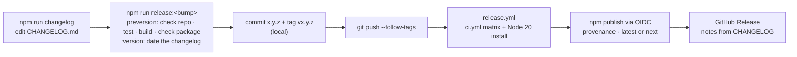

# Releasing repown

How a version gets from `main` to npm. One card per job: read the headline, and open
**Show how** for the detail. The reasons are in
[ADR-015](decisions/ADR-015-releases-from-tags.md).

**In three lines:**

```
npm run changelog        # draft "## [Unreleased]" in CHANGELOG.md from git history, then edit it
npm run release:minor    # or :patch  :major  :beta   (checks, tests, dates the changelog, commits, tags)
git push --follow-tags   # CI publishes to npm and creates the GitHub Release
```



## Find your job

| I want to… | Card |
| --- | --- |
| Ship a fix or a feature | [1](#1-cut-a-release) |
| Ship a beta without making it `latest` | [2](#2-ship-a-prerelease) |
| Know what the checks refuse | [3](#3-what-stops-a-release) |
| Undo a bad release | [4](#4-a-release-went-wrong) |
| Set up publishing (once per package) | [5](#5-one-time-setup) |
| Run the release tool by hand | [6](#6-the-release-tool) |

## 1. Cut a release

Pick the bump from what changed: a fix is `patch`, a new command or option is `minor`,
and removing or renaming one is `major`. Before 1.0, a breaking change is a `minor`.

<details><summary>Show how</summary>

1. `npm run changelog` adds every commit subject since the last `v*` tag under
   `## [Unreleased]`. It skips `Plan:` commits, version commits and lines that are
   already there. Rewrite the entries for users: what changed for them, not how.
   Commit the edit.
2. `npm run release:patch` (or `:minor`, `:major`) runs `npm version`, which:
   - runs `preversion`: `npm run release:check`, `npm test`, `npm run build`,
     `npm run pack:check`. Any failure stops it with nothing changed;
   - bumps `package.json` and `package-lock.json`;
   - runs `version`: moves Unreleased under `## [x.y.z] - <today>`, adds the compare
     links, and stages CHANGELOG.md;
   - commits `x.y.z` and creates the annotated tag `vx.y.z`, both local.
3. `git push --follow-tags` pushes the commit and the tag. The tag starts
   `.github/workflows/release.yml`.
4. Watch the **Release** run in GitHub Actions. When it's green,
   `npm view repown version` shows the new version, and the GitHub Release has the
   CHANGELOG notes.

</details>

## 2. Ship a prerelease

`npm run release:beta` makes `x.y.z-beta.N`, which is published under the `next`
dist-tag. `npm install -g repown` doesn't pick it up; `npm install -g repown@next` does.

<details><summary>Show how</summary>

- The first `release:beta` after `0.1.0` makes `0.1.1-beta.0`, and the next makes
  `0.1.1-beta.1`. For a beta of a minor, run `npm version preminor --preid=beta` once,
  then `release:beta`.
- The workflow picks the dist-tag from the version: anything containing `-` goes to
  `next` and becomes a GitHub **prerelease**. It never becomes `latest`.
- To ship the final version, run `npm run release:patch` (or `:minor`) from the beta.
  npm drops the suffix.

</details>

## 3. What stops a release

Every check runs before anything is written, so a refusal leaves the repository as it
was.

<details><summary>Show how</summary>

| Check | Refuses when | Fix |
| --- | --- | --- |
| `check repo` · branch | not on `main` | `git switch main` |
| `check repo` · tree | uncommitted changes | commit or stash |
| `check repo` · upstream | `main` is behind its upstream after a fetch | `git pull` |
| `check repo` · upstream | *skipped* (warned, not passed) when there's no upstream | `git push -u origin main` |
| `check repo` · changelog | Unreleased is empty | `npm run changelog`, then edit |
| tests / build | anything red | fix it |
| `check package` | the tarball lacks `dist/cli.js`, README, LICENSE or CHANGELOG, or ships source maps, `src/`, `test/`, `scripts/` or `docs/` | fix `files` in package.json |
| release.yml | the tag isn't `v` + package.json's version | cut the tag with `npm run release:*`, never by hand |
| release.yml | the tagged commit isn't on `main` | release from `main` |
| release.yml | CHANGELOG has no section, or an empty one, for the version | the `version` hook writes it; don't tag by hand |

</details>

## 4. A release went wrong

A published version number can never be reused. The fix is always a new version.

<details><summary>Show how</summary>

- **Broken on npm:** `npm deprecate repown@x.y.z "broken: use x.y.(z+1)"`, then cut a
  patch. Don't `npm unpublish`: it's limited to 72 hours, it can't free the number, and
  it breaks anyone who already installed that version.
- **Wrong dist-tag:** `npm dist-tag add repown@<good> latest`.
- **The workflow failed before publishing:** fix it on `main`, then re-run the failed
  jobs of the Release run. It skips anything already done (a published version, an
  existing GitHub Release).
- **A fix for an older line (a backport):** not supported. Every stable release becomes
  `latest`, and tags must be on `main`, so a 0.1.x after 0.2.0 would move `latest`
  backwards. Release the fix as the next version on `main` instead.
- **The tag was pushed at the wrong commit, and nothing published yet:** delete the tag
  locally and remotely, then cut it again with `npm run release:*`.

</details>

## 5. One-time setup

This was done once for `repown`. It only needs doing again if the workflow file is
renamed or the package moves.

<details><summary>Show how</summary>

1. **The first version is published by hand**, because npm can't trust a workflow for
   a package that doesn't exist yet. The version is already in package.json, so cut it
   through the same hooks as every later release:

   ```
   npm version 0.1.0 --allow-same-version   # checks, tests, dated CHANGELOG, commit, tag v0.1.0
   npm publish                              # from that commit, with a one-off npm token or 2FA
   git push --follow-tags
   ```

   The Release run sees 0.1.0 is already on npm, skips publishing, and only creates
   the GitHub Release from the dated CHANGELOG section.
2. **Trust the workflow.** This needs 2FA on the npm account and npm ≥ 11.15:

   ```
   npx npm@latest trust github repown --repo makubexD/repown --file release.yml --allow-publish
   ```

   Or go to npmjs.com → the package → Settings → Trusted Publisher → GitHub Actions:
   owner `makubexD`, repository `repown`, workflow `release.yml`.
3. **Shut the token door.** On npmjs.com, go to the package → Settings → Publishing
   access → "Require two-factor authentication and disallow tokens". Then delete any
   npm token used for step 1.
4. **Optional:** a GitHub tag ruleset for `v*`, so only you can create release tags.

Nothing is stored in GitHub: no npm token and no secret. The workflow's
`id-token: write` permission is the whole handshake.

</details>

## 6. The release tool

`scripts/release.ts` holds the commands the npm scripts call. It uses repown's own
grammar and dispatcher, so `--help` works at every level and exit codes are `0` ok,
`1` failed, `2` usage error. It's never shipped.

<details><summary>Show how</summary>

| Command | What it does |
| --- | --- |
| `node scripts/release.ts changelog draft [--dry-run]` | add commit subjects since the last `v*` tag to Unreleased (`--dry-run` prints the file instead) |
| `node scripts/release.ts changelog release [<version>]` | move Unreleased under a dated heading (default: package.json's version) |
| `node scripts/release.ts changelog notes [<version>]` | print one version's section on stdout |
| `node scripts/release.ts check repo [--branch <name>]` | branch, clean tree, upstream, Unreleased (default branch: `main`) |
| `node scripts/release.ts check package <file\|->` | read `npm pack --dry-run --json` output and check the file list |

Every command takes `--cwd <dir>`. `node scripts/release.ts help <command>` shows the
options.

</details>
